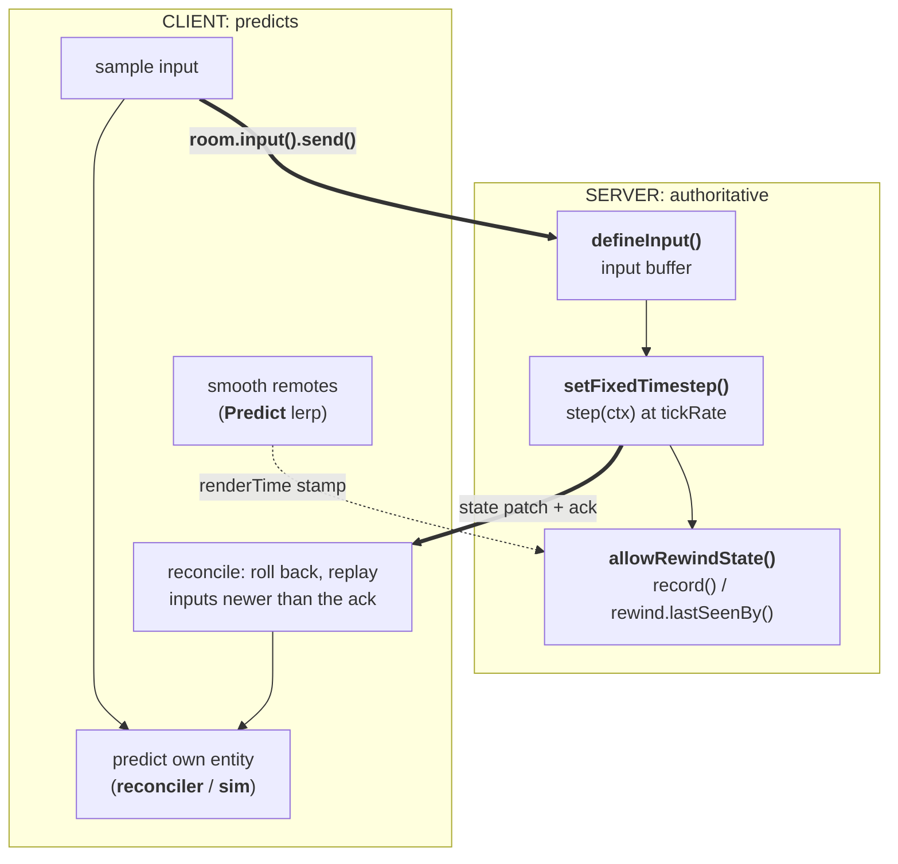

<!-- Generated by tools/sync.mjs from /netcode, /netcode/server-input, /netcode/client-prediction. Do not edit. -->

# Netcode

Fast-paced games can't wait for the network. If your character only moves after a round-trip to the server, controls feel sluggish. But if the client simply moves itself, the server is no longer in charge and cheating becomes trivial.

Colyseus 0.18 gives you both: the server stays authoritative, and the client **predicts**. Your own movement responds instantly, remote players move smoothly, and hits register against what you saw on screen. The framework runs the prediction, reconciliation, and rewind loops. You supply the deterministic step function.

> **Note:**
>
> **Available in Colyseus 0.18+.** These APIs (`room.input()`, `Predict`, `defineInput()`, `setFixedTimestep()`, `allowRewindState()`) are new in 0.18 and have no equivalent in earlier versions.

## The mental model

The stack is one loop split across the server and the client. Each half is configured independently, but they only make sense together:

- The **server** runs the authoritative simulation at a **fixed tick rate**.
- The **client predicts** its own entity by running the same step function locally. When the server's authoritative state arrives, it **reconciles**: roll back, replay the inputs the server hasn't processed yet, and smoothly correct any mismatch.
- **Remote** entities are smoothed from the server stream (interpolated a little in the past, or dead-reckoned forward).
- For hits, the server **rewinds** other entities to where the shooter *saw* them (their render time). That way, a well-aimed shot at a moving target registers.

> One input per fixed step; one `predict.tick()` per render frame drives everything.



## Which primitive for which interaction?

Every interaction in your game maps onto a small set of primitives. Find the row that matches, then jump to the page that documents it:

| Interaction | Primitive | Page |
|---|---|---|
| Your own movement (one entity, flat fields) | `predict.reconciler` | [Client Prediction](https://docs.colyseus.io/netcode/client-prediction.md) |
| Anything your inputs push / carry / throw (paddle + puck, vehicle + cargo) | `predict.sim` (composite scalars) | [Client Prediction](https://docs.colyseus.io/netcode/client-prediction.md#composite--engine-state-predictsim) |
| Your movement inside a physics engine (Rapier/crashcat) | `predict.sim` (engine handle) | [Client Prediction](https://docs.colyseus.io/netcode/client-prediction.md#composite--engine-state-predictsim) |
| Remote players you don't control | `Predict` `lerp` | [Client Prediction](https://docs.colyseus.io/netcode/client-prediction.md#remote-entities) |
| Server-driven ballistics nobody touches | `Predict` `reckon` | [Recipes](https://docs.colyseus.io/netcode/recipes.md) |
| Discrete events your timeline produces (a goal, a kill, a pickup) | `predict.defineEvent` + `ctx.predict` | [Client Prediction](https://docs.colyseus.io/netcode/client-prediction.md#optimistic-events-defineevent) |
| Projectiles you spawn (predicted → authoritative handoff) | `predict.spawns` | [Recipes](https://docs.colyseus.io/netcode/recipes.md#predicted-projectiles-predictspawns) |
| Hitscan against others (instantaneous, server-owned target) | `allowRewindState` + `rewind.lastSeenBy` | [Lag Compensation](https://docs.colyseus.io/netcode/lag-compensation.md) |

## Read in order

New to prediction? Read top to bottom. Each page builds on the one before it:

- [Server Input & Timestep](https://docs.colyseus.io/netcode/server-input.md)
- [Client Prediction](https://docs.colyseus.io/netcode/client-prediction.md)
- [Lag Compensation](https://docs.colyseus.io/netcode/lag-compensation.md)
- [Determinism & The Contract](https://docs.colyseus.io/netcode/determinism.md)
- [Recipes](https://docs.colyseus.io/netcode/recipes.md)

## Runnable reference

The [**Prediction Playground**](https://prediction-colyseus.vercel.app/) covers this whole section as twelve small labs, each isolating one concept. Rollback and reconciliation, the interpolation modes, dead reckoning, lag compensation, optimistic events, predicted spawns, composite worlds. Every lab has a latency slider and visualizations of the SDK internals (server ghosts, pending-input chips, rewind markers). Each also shows the SDK-facing code it runs. The [source is on GitHub](https://github.com/colyseus/prediction-playground).

### Premium demos

The playground isolates each concept. These {premiumDemos.length} prototypes combine them: authoritative server, client prediction, smoothed remotes and lag compensation running as one stack. Each is playable in the browser.

The set is actively expanding, with new prototypes and with more engine ports of the existing ones. Air Hockey already ships Godot and Unity clients alongside its Three.js build.

> **Note:**
>
> Coming from the manual approach? The [Phaser tutorial](https://docs.colyseus.io/learn/tutorial/phaser/linear-interpolation.md) builds prediction, interpolation, and a fixed tick rate **by hand** to teach the concepts. This section documents the built-in 0.18 API that does the same work for you.

---
Source: https://docs.colyseus.io/netcode

# Server Input & Fixed Timestep

This page covers the **server half** of the netcode stack. Declare what input each client sends, consume it, and advance the authoritative simulation at a fixed tick rate. The matching client half lives in [Client Prediction](https://docs.colyseus.io/netcode/client-prediction.md).

> **Note:**
>
> **Available in Colyseus 0.18+.**

## At a glance

```ts filename="GameRoom.ts"
import { Room } from "@colyseus/core";
import { MoveInput } from "./shared/MoveInput";
import { applyInput } from "./shared/applyInput";

class GameRoom extends Room<{ input: MoveInput }> {
  state = new GameState();

  // Per-client input schema (flat primitives only), buffered per session.
  inputs = this.defineInput(MoveInput, { bufferMaxSize: 64 });

  // Records attached entities' positions (auto, on each broadcast).
  rewind = this.allowRewindState({ maxRewindMs: 500 });

  onCreate() {
    this.rewind.attachAll(this.state.players, { fields: ["x", "y"] });
    // Fixed-step loop @ 30 Hz: advertises the rate to predicting clients.
    this.setFixedTimestep((ctx) => this.step(ctx), 30);
  }

  step(ctx) {
    for (const [sid, p] of this.state.players) {
      const cmd = this.inputs.get(sid).next();     // one input per tick
      if (cmd) applyInput(p, cmd, ctx.dt);          // SAME fn the client predicts with
    }
    // ...advance world, then hit tests (see Lag Compensation).
  }
}
```

## `defineInput(type, options)`

Declares the per-client input schema and buffers inbound frames. Assign it once (typically as a class field): it returns the input API you consume as `this.inputs.get(sessionId)`, the same per-session lookup verb as `room.clients.get()`.

```ts
inputs = this.defineInput(MoveInput, { bufferMaxSize: 64 });
```

Options and their defaults:

- **`bufferMaxSize`**: per-client buffer depth (default 32). `0` disables buffering (only `.latest` remains readable).
- **`seqField`**: most rooms leave this unset: on a reliable, in-order channel every frame is unique, and the framework tracks its own sequence. Name a monotonic numeric field of your input only when you need dedupe and `at(value)` lookup (lockstep, or a hand-rolled rollback).
- **`sanitize`** / **`idle`**: see below.

Inputs are **flat schemas: primitives only**. No nested schemas or collections in an input. Use `int8`/`uint8`/`float32` etc. and refine the legal set with generics (`t.int8<-1 | 0 | 1>()`):

```ts filename="shared/MoveInput.ts"
import { schema, t, type SchemaType } from "@colyseus/schema";

export const MoveInput = schema({
  moveX: t.int8<-1 | 0 | 1>(),
  moveZ: t.int8<-1 | 0 | 1>(),
  jump:  t.boolean(),
  yaw:   t.float32(),
});

// schema() returns a value. Derive the TS type for Room<{ input: ... }>:
export type MoveInput = SchemaType<typeof MoveInput>;
```

> **Note:**
>
> Calling `defineInput()` does more than buffer input: it powers the client's [`room.clock`](https://docs.colyseus.io/netcode/client-prediction.md#roomclock) (clock-sync and RTT ride the input acks). The call also lets `room.input()` resolve the schema without a client-side constructor. A room that never calls it leaves the client clock as a stub.

### Consuming input

The accessor `this.inputs.get(sessionId)` exposes the per-client buffered stream. Pick **one** consumption style per room, matched to how your simulation steps:

- **Iterate**: the per-entity loop. Consumes one frame at a time, so the lag-comp `renderTime` stamp tracks each individual input:

  ```ts
  step(ctx) {
    for (const [sid, p] of this.state.players) {
      // frame by frame: the ack and renderTime advance once per input
      for (const cmd of this.inputs.get(sid)) {
        applyInput(p, cmd, ctx.dt);
      }
    }
  }
  ```

- **`next()`**: take **exactly one**. Right when a single shared solver step moves every body together: consume one input per entity, then step the world once:

  ```ts
  step(ctx) {
    for (const [sid, p] of this.state.players) {
      const cmd = this.inputs.get(sid).next();   // oldest pending frame, or undefined
      if (cmd) applyInput(p, cmd, ctx.dt);
    }
    this.world.step(ctx.dt);                     // one solver step moves every body
  }
  ```

- **`drain()`**: take **all** buffered frames as an array. The ack (`lastProcessed`) lands on the newest frame. Use it when you need the array itself: its length, a replay recording, or a physics call that accepts a list.

  ```ts
  step(ctx) {
    for (const [sid, p] of this.state.players) {
      const cmds = this.inputs.get(sid).drain();  // whole burst, oldest first
      for (const cmd of cmds) {
        applyInput(p, cmd, ctx.dt);
      }
    }
  }
  ```

> **Warning:**
>
> Draining all frames but simulating only the latest jumps the ack past inputs you never ran. The client then reconciles against state it can't reproduce. Match the consumption style to how you step.

Beyond consuming, the accessor offers non-consuming reads and bookkeeping:

- **`latest`**: the most recent decoded frame, without consuming it. `peek()`, `take(n)` and `size` round out the buffer access.
- **`consumedCount`**: how many inputs this room has consumed; this is the reconcile ack the client sees.
- **`wasIdle`**: whether the last read was a synthesized idle frame.
- **`renderTime`** / **`reckonTime`**: the lag-comp instants. `renderTime` is the raw stamp of the last consumed input (`0` until one is stamped). `reckonTime` is always usable: it resolves to the room clock's current time until a reckon-stamped input is consumed, so `channel.reckonTime` needs no fallback. For hit tests, prefer [`rewind.lastSeenBy()`](https://docs.colyseus.io/netcode/lag-compensation.md) over reading these directly.

### Never trust the wire: `sanitize`

The wire carries whatever the client chooses to encode: an `int8` axis can arrive as `127` (a speed hack), a `float32` as `NaN`. Declare each field's legal domain **once** at `defineInput`, and every decoded frame is fixed up **in place** before anything reads it:

```ts
inputs = this.defineInput(MoveInput, {
  bufferMaxSize: 64,
  sanitize: {                                // map form: range clamps
    moveX: [-1, 1],
    moveZ: [-1, 1],
    yaw:   [-Math.PI, Math.PI],
  },
  // or a callback for anything beyond ranges:
  // sanitize: (f) => { f.yaw = wrapAngle(f.yaw); },
});
```

- Sanitizers **modify, never reject**: a malformed value becomes a legal one. Honest clients are untouched (in-range values pass through as-is), so they never diverge from the server's sanitized result.
- The map form is **NaN-safe**: `NaN` lands on the clamp floor, closing the classic `Math.min(NaN, …)` poisoning hole that hand-rolled clamps share.
- Sanitizing handles **value domains**, not game rules. Semantic checks ("slot must name an owned weapon") stay in your simulation.

### Empty ticks: the `idle` policy

What should happen on a tick where a client sent nothing? Pick one of three policies, declared **once** at `defineInput({ idle })` and applied automatically when you consume:

- **Skip** (default): don't declare `idle`. An empty tick yields nothing: `drain()` returns `[]`, `next()` returns `undefined`, and you keep the `if (cmd)` guard from the [loops above](#consuming-input). Right for strict fixed-timestep games where the client sends one input per step.

- **Synthesize**: declare a policy, and an empty tick yields one frame: the schema's **defaults** overlaid with your overrides. The callback runs lazily (only on actually-empty ticks) and closes over the room. On the consuming side, `next()` always yields a frame, so the loop loses its `if (cmd)` branch:

  ```ts
  inputs = this.defineInput(MoveInput, {
    bufferMaxSize: 64,
    idle: ({ latest, sessionId }) => {
      const p = this.state.players.get(sessionId);
      if (!p) return true;                       // defaults frame for the empty seat
      return { yaw: p.yaw, jump: false };        // defaults ⊕ overrides
    },
  });
  
  step(ctx) {
    for (const [sid, p] of this.state.players) {
      const cmd = this.inputs.get(sid).next();   // idle declared: never undefined
      applyInput(p, cmd, ctx.dt);                // gravity keeps integrating
      if (cmd.jump) p.tryJump();                 // idle frame: jump=false, no-op
    }
    this.world.step(ctx.dt);
  }
  ```

- **Hold everything**: return the whole last input as the idle frame, so a held key keeps moving the player through a packet gap. Two guards keep it honest. In the policy, hold only while the client is still connected. In the loop, check `wasIdle` before edge-triggered actions, because a held frame repeats `jump: true` for every tick of the gap:

  ```ts
  inputs = this.defineInput(MoveInput, {
    bufferMaxSize: 64,
    idle: ({ latest, sessionId }) => {
      const client = this.clients.get(sessionId);
      if (client?.state !== ClientState.JOINED) return true;  // dropped: defaults
      return latest ?? true;                     // hold the last input through the gap
    },
  });
  
  step(ctx) {
    for (const [sid, p] of this.state.players) {
      const inp = this.inputs.get(sid);
      const cmd = inp.next();                    // gap: the held key stays down
      applyInput(p, cmd, ctx.dt);
      if (cmd.jump && !inp.wasIdle) p.tryJump(); // held jump must not re-fire
    }
    this.world.step(ctx.dt);
  }
  ```

The policy also covers **absent sessions**. A player who dropped but is still inside their `allowReconnection` window lingers in `state`. The input accessor resolves through a registry that outlives the connection, so your loop keeps synthesizing idle frames for the empty seat. No `if (!cmd) continue` needed.

> **Warning:**
>
> Three things to know about synthesized idle frames. They are **not consumed inputs**: they advance neither the reconcile ack (`lastProcessed`) nor `renderTime`. They are **one reused instance** per client: read within the tick, don't store. And never build overrides by **spreading** a schema instance (`{ ...latest, yaw }`): schema fields are prototype accessors, so the spread copies none of them. Return `latest` itself, or name the fields you want.

Per-call `{ idle }` overrides the room policy for that call; `{ idle: false }` suppresses it.

## `setFixedTimestep(step, tickRate, options?)`

Hand the framework your step function and a rate; it runs the accumulator loop for you. Each `step` advances by the **same** fixed `dt = 1/tickRate`, and that rate is **advertised to clients** through the join handshake so they predict at the matching `dt`.

```ts
this.setFixedTimestep((ctx) => this.step(ctx), 30);    // 30 Hz
```

The `ctx` (a `StepContext`) carries the timing your simulation needs:

| Field | Meaning |
|---|---|
| `ctx.dt` | Fixed step in **seconds** (`1/tickRate`) |
| `ctx.dtMs` | Fixed step in **milliseconds** |
| `ctx.tick` | Monotonic step index |
| `ctx.subSteps` | Physics sub-steps per input tick (≥ 1) |
| `ctx.subDt` | Sub-step in seconds (`dt / subSteps`) |
| `ctx.subDtMs` | Sub-step in milliseconds |

> **Note:**
>
> Don't also pass a `tickRate` to `defineInput()`: `setFixedTimestep` is the single source of the simulation rate.

### Sub-stepping: high-rate physics on a low network rate

By default the input/network rate **is** the physics rate (see [the contract](https://docs.colyseus.io/netcode/determinism.md#the-contract)). Asking for "30 inputs/sec" forces 30 Hz simulation, which can be too coarse for stable physics. **Sub-stepping** is the escape hatch. Declare it once on the server:

```ts
this.setFixedTimestep((ctx) => {
  this.applyInputs(ctx);                                    // ONE input per client per step
  for (let i = 0; i < ctx.subSteps; i++) {
    this.world.step(ctx.subDt);
  }
}, 30, { subSteps: 2 });                                    // 30 inputs/sec, 60 Hz physics
```

One input still drives exactly one fixed step, so the replay invariant is untouched; *inside* that step, the engine integrates `subSteps` sub-steps of `subDt`. The handshake cascades `subSteps` alongside `tickRate`, so the client reconciler's `ctx` carries the **same** values. Your shared `step` function runs the identical loop on both sides.

Two rules keep it correct. Apply the input **once per step**, not once per sub-step (an impulse-like input applied per sub-step would double-fire). Never hand-derive the sub-step count or dt on either side: read `ctx.subSteps` / `ctx.subDt`.

## `setTimestep` (variable step)

For a non-deterministic game loop that just needs wall-clock delta (no prediction), `setTimestep(callback, delay?)` invokes your callback with the measured `deltaTime`:

```ts
this.setTimestep((deltaTime) => this.update(deltaTime));    // default ~16.6ms (60fps)
```

> **Warning:**
>
> `setSimulationInterval()` is the deprecated name for `setTimestep()` and still works (it forwards). For client-predicted games you want `setFixedTimestep()` instead: a variable step can't be replayed deterministically.

## Next

→ [Client Prediction](https://docs.colyseus.io/netcode/client-prediction.md): predict this input on the client and reconcile to the server.

---
Source: https://docs.colyseus.io/netcode/server-input

# Client Prediction & Reconciliation

This page is the **client half** of the netcode stack. Send input, predict your own entity, reconcile to the server's authoritative state, and smooth the entities you don't control. The matching server half lives in [Server Input & Timestep](https://docs.colyseus.io/netcode/server-input.md).

> **Note:**
>
> **Available in Colyseus 0.18+** across the official SDKs. Pick your SDK inside each example below. The GameMaker and C ports expose the same surface. Building with React? `@colyseus/react` wraps these APIs as [netcode hooks](https://docs.colyseus.io/getting-started/react.md#netcode-hooks-colyseus-018).

## At a glance

**TypeScript**

```ts
import { Predict } from "@colyseus/sdk";
import { applyInput } from "./shared/applyInput";   // SAME function the server runs

const predict = Predict.get(room, { mode: "lerp", delay: 100 });

// Remote players: render 100ms in the past, interpolated between snapshots.
predict.attachAll("players", { mode: "lerp", fields: ["x", "y"] });

// Local player: the input handle is the ONLY thing that stages + sends.
const input = room.input({ type: MoveInput });
const me = predict.reconciler(self, {
  input,                                     // every scalar field of `self` mirrors by default
  step: (ctx, s, cmd) => applyInput(s, cmd, LEVEL, ctx.dt),
  smoothMs: 65,
});

function frame(now) {                      // pass the rAF timestamp through
  const n = predict.tick(now);             // fixed input steps due this frame
  for (let i = 0; i < n; i++) {
    input.data.moveX = moveX();            // stage the wire input
    input.data.jump = jump();
    input.send();                          // transmit + buffer, the reconciler observes
  }
  for (const [, p] of room.state.players) {
    draw(predict.value(p, "x"), predict.value(p, "y"));  // ONE read idiom, local + remote
  }
  requestAnimationFrame(frame);
}
```

**C#**

```cs
using Colyseus.Predict;

var predict = Predict.Get(room, new PredictGetOptions { Mode = PredictMode.Lerp, Delay = 100 });

// Remote players: render 100ms in the past, interpolated between snapshots.
predict.AttachAll("players", new AttachConfig {
    ["x"] = PredictMode.Lerp, ["y"] = PredictMode.Lerp,
});

// Local player: the input handle is the ONLY thing that stages + sends.
var cmd = new MoveInput();
var input = room.Input(cmd);
var me = predict.Reconciler(self, new ReconcilerOptions<Player, MoveInput> {
    Input = input,                                 // every scalar field of `self` mirrors by default
    SmoothMs = 65,
    Step = (ctx, s, c) => ApplyInput(s, c, LEVEL, ctx.Dt),  // SAME function the server runs
});

void Update() {                            // once per render frame
    int steps = predict.Tick();            // fixed input steps due this frame
    for (int i = 0; i < steps; i++) {
        cmd.moveX = MoveX();               // stage the wire input
        cmd.jump = Jump();
        input.Send();                      // transmit + buffer, the reconciler observes
    }
    Draw(me.Value("x"), me.Value("y"));    // your entity: the reconciled read
    // remotes: predict.Value(p, "x"), the smoothed read
}
```

**Lua**

```lua
local Predict = require 'colyseus.predict.predict'

local predict = Predict.get(room)

-- Remote players: interpolated between snapshots, 100ms in the past (the default delay).
predict:attach_all("players", { x = "lerp", y = "lerp" })

-- Local player: the input handle is the ONLY thing that stages + sends.
local input = room:input()
local me = predict:reconciler(self_player, {
  input = input,
  fields = { "x", "y", "vx", "vy" },        -- the fields the step touches
  smooth_ms = 65,
  -- the SAME function the server runs
  step = function(ctx, s, cmd) apply_input(s, cmd, LEVEL, ctx.dt) end,
})

function update(self, dt)                   -- once per render frame
  local steps = predict:tick()              -- fixed input steps due this frame
  for _ = 1, steps do
    input.data.moveX = move_x()             -- stage the wire input
    input.data.jump = jump()
    input:send()                            -- transmit + buffer, the reconciler observes
  end
  draw(me:value("x"), me:value("y"))        -- your entity: the reconciled read
  -- remotes: predict:value(p, "x"), the smoothed read
end
```

**Haxe**

```haxe
import io.colyseus.predict.Predict;

var predict = Predict.get(room, { mode: "lerp", delay: 100 });

// Remote players: render 100ms in the past, interpolated between snapshots.
predict.attachAll("players", { mode: "lerp", fields: ["x", "y"] });

// Local player: the input handle is the ONLY thing that stages + sends.
var input = room.input({ type: MoveInput });
var cmd = input.data;
var me = predict.reconciler(self, {
    input: input,
    fields: ["x", "y", "vx", "vy"],         // the fields the step touches
    smoothMs: 65,
    // the SAME function the server runs
    step: (ctx, s, inp) -> applyInput(s, inp, LEVEL, ctx.dt),
});

function frame() {                          // once per render frame
    var steps = predict.tick();             // fixed input steps due this frame
    for (_ in 0...steps) {
        cmd.moveX = moveX();                // stage the wire input
        cmd.jump = jump();
        input.send();                       // transmit + buffer, the reconciler observes
    }
    draw(me.value("x"), me.value("y"));     // your entity: the reconciled read
    // remotes: predict.value(p, "x"), the smoothed read
}
```

**GDScript**

```gdscript
var predict = Colyseus.Predict.of(room)

# Remote players: interpolated between snapshots, 100ms in the past (the default delay).
# The third argument leaves your own entity out: the reconciler owns it.
predict.attach_all("players", {
    "x": Colyseus.Predict.LERP, "y": Colyseus.Predict.LERP,
}, room.get_session_id())

# Local player: the input handle is the ONLY thing that stages + sends.
var input = room.input()
var me = predict.reconciler(self_player, {
    "input": input,
    "fields": ["x", "y", "vx", "vy"],   # the fields the step touches
    "smooth_ms": 65.0,
    "step": _apply_input,               # the SAME function the server runs
})

func _process(_delta):                  # once per render frame
    var steps: int = predict.tick()     # fixed input steps due this frame
    for i in steps:
        input.data.moveX = move_x()     # stage the wire input
        input.data.jump = jump()
        input.send()                    # transmit + buffer, the reconciler observes
    draw(me.value("x"), me.value("y"))  # your entity: the reconciled read
    # remotes: predict.value(p, "x"), the smoothed read
```

**Dart**

```dart
final predict = Predict.get(room);

// Remote players: interpolated between snapshots, 100ms in the past (the default delay).
predict.attachAll('players',
    config: {'x': PredictMode.lerp, 'y': PredictMode.lerp},
    exceptKey: room.sessionId);   // leave your own entity out: the reconciler owns it

// Local player: the input handle is the ONLY thing that stages + sends.
final input = room.input()!;
final me = predict.reconciler(self,
  input: input,
  fields: const ['x', 'y', 'vx', 'vy'],   // the fields the step touches
  smoothMs: 65,
  step: (ctx, s, cmd) => applyInput(s, cmd, level, ctx.dt), // SAME fn as the server
);

void onFrame() {                          // once per render frame
  Colyseus.pump();                        // decode inbound, deliver events
  final steps = predict.tick();           // fixed input steps due this frame
  for (var i = 0; i < steps; i++) {
    input.data['moveX'] = moveX();        // stage the wire input
    input.data['jump'] = jump();
    input.send();                         // transmit + buffer, the reconciler observes
  }
  draw(me.value('x'), me.value('y'));     // your entity: the reconciled read
  // remotes: predict.value(p, 'x'), the smoothed read
}
```

The reconciler is a pure **observer**: it watches the handle's sends and predicts each one. You never feed input to the reconciler directly. The frame driver runs `predict.tick()`, sends that many inputs through the handle, and everything downstream reacts. For taps and edges that must land on exactly one step, see [buffer, then consume](https://docs.colyseus.io/netcode/recipes.md#taps-between-steps-buffer-then-consume).

> **Warning:**
>
> **Send before you read.** Within a frame, run the send loop right after `predict.tick()`, then read render values. A `predict.value()` read between `tick()` and the sends is one step stale (the SDK warns once).

## `room.input(options)`

Returns the per-room [`InputHandle`](#inputhandle-reference): the single surface that stages and sends input. Created once: later calls return the same handle.

**TypeScript**

```ts
const input = room.input({
  type: MoveInput,          // input schema constructor (matches the server's defineInput)
});
```

**C#**

```cs
var cmd = new MoveInput();      // the instance you stage fields on
var input = room.Input(cmd);
```

**Lua**

```lua
-- the input schema arrives via the join handshake (the server's defineInput)
local input = room:input()
```

**Haxe**

```haxe
var input = room.input({ type: MoveInput });
```

**GDScript**

```gdscript
# takes no options: the schema arrives via the join handshake
var input = room.input()
```

**Dart**

```dart
// null when the server room declares no defineInput()
final input = room.input();
```

- **`type`**: the input schema constructor. Optional when the server called `defineInput()`: the schema then arrives via the join handshake and is used automatically. An explicit constructor always wins.
- **`mode`**: `"reliable"` (default) or `"unreliable"`. Over plain WebSocket, stay reliable. On a datagram-capable transport, `{ mode: "unreliable", historySize: 4 }` is the recommended rollback setup. Each packet carries the last N inputs as redundancy, so a drop costs nothing and nothing head-of-line blocks. That transport is [WebTransport](https://docs.colyseus.io/server/transport/webtransport.md) alone: experimental, and supported by the JavaScript/TypeScript SDK only. Other SDKs reject `"unreliable"` at construction for now.
- **`historySize`**: unreliable-mode redundancy depth (default 3). Ignored in reliable mode.
- **`renderDelay`**: your remote interp buffer in ms, used for the lag-comp stamp. **Usually omit it**: wiring the handle through `predict.reconciler`/`predict.sim` binds it to the Predict's lerp `delay` automatically. The buffer you render at and the server's rewind instant then come from one number.
- **`allowRewind`**: a predicate selecting which inputs carry the lag-comp timestamp. It's a bandwidth trim: stamp only the inputs the server actually rewinds for, e.g. `(d) => d.fire`. Reliable mode only: an unreliable packet stamps its whole redundancy ring or none of it, so the predicate is ignored there. See [Lag Compensation](https://docs.colyseus.io/netcode/lag-compensation.md).

The GDScript handle accepts no options object: `render_delay` is a property, and `input.set_rewind_field("fire")` replaces `allowRewind`.

Stage fields on `input.data`, then `input.send()`, one call per fixed step:

**TypeScript**

```ts
input.data.moveX = 1;
input.data.jump = true;
input.send();
```

**C#**

```cs
cmd.moveX = 1;        // the instance passed to Room.Input()
cmd.jump = true;
input.Send();
```

**Lua**

```lua
input.data.moveX = 1
input.data.jump = true
input:send()
```

**Haxe**

```haxe
input.data.moveX = 1;
input.data.jump = true;
input.send();
```

**GDScript**

```gdscript
input.data.moveX = 1
input.data.jump = true
input.send()
```

**Dart**

```dart
input.data['moveX'] = 1;
input.data['jump'] = true;
input.send();
```

Only declared schema fields ride the wire. Writing an undeclared field does nothing, and with the debug panel active the SDK warns you once per key at `send()`.

The handle also surfaces the server-advertised rates from the handshake: `input.tickRate`, `input.stepSeconds`, `input.stepMs`, `input.patchRate`, `input.subSteps`. Predict at `input.stepSeconds` so your replay stays bit-identical with the server.

> **Warning:**
>
> The server must advertise a fixed rate (via `setFixedTimestep`) for `input.tickRate` to be defined. A robust client asserts it:
> ```ts
> if (input.tickRate === undefined) throw new Error("server did not advertise a fixed tick rate");
> ```
>     The same check ports as `input.TickRate == null` (C#), `input.tick_rate == nil` (Lua), and `input.tickRate == null` (Haxe). The GDScript and Flutter bindings report `0` instead of null when the rate is unadvertised.

## `Predict.get(room, options)`

The entry point for all client-side smoothing and prediction. Create one per room and share the instance. Each `Predict.get` call constructs a fresh, independent `Predict`:

**TypeScript**

```ts
const predict = Predict.get(room, { mode: "lerp", delay: 100 });
```

**C#**

```cs
var predict = Predict.Get(room, new PredictGetOptions { Mode = PredictMode.Lerp, Delay = 100 });
```

**Lua**

```lua
local predict = Predict.get(room, { mode = "lerp", delay = 100 })
```

**Haxe**

```haxe
var predict = Predict.get(room, { mode: "lerp", delay: 100 });
```

**GDScript**

```gdscript
# takes only the room: declare mode/delay per attach
var predict = Colyseus.Predict.of(room)
```

**Dart**

```dart
// takes only the room: declare mode/delay per attach
final predict = Predict.get(room);
```

The options seed the room-wide defaults every attach inherits when it omits an option (`mode`, `delay`, `smoothMs`, `snap`, and a reckon `step`/`substep`). `predict.setDefaults(opts)` changes them later, and `predict.mode` reads the current default mode (`SetDefaults` / `Mode` in C#). A change only reaches attaches made *after* the call, since each attach snapshots what it resolved.

> **Note:**
>
> The construction options object is available in JavaScript, C#, Haxe and Lua. The GDScript and Dart bindings take only the room and declare `mode`/`delay` per attach.

Call `predict.tick(now)` **once per render frame**, passing the rAF timestamp. It returns the number of fixed input steps due this frame. It also drives everything it owns: reconcile on new acks, correction decay, remote smoothing, event settlement.

`now` is optional in every SDK. Omit it and the room clock is read for you, which is what the examples above do. That saves picking a platform clock that may not share the SDK's epoch. Pass it in JavaScript anyway: the rAF timestamp is the exact frame time, on the same axis as the default.

### Remote entities

For entities you **don't** control, attach smoothing. `attachAll` covers every entry of a collection; `attach` a single instance:

**TypeScript**

```ts
predict.attachAll("players", { mode: "lerp", fields: ["x", "y"] });
```

**C#**

```cs
predict.AttachAll("players", new AttachConfig {
    ["x"] = PredictMode.Lerp, ["y"] = PredictMode.Lerp,
});

// per-field options instead of a bare mode:
predict.AttachAll("players", new AttachConfig {
    ["x"] = new PredictFieldOptions { Mode = PredictMode.Lerp, Delay = 100 },
});
```

**Lua**

```lua
-- one config spread over a list of fields:
predict:attach_all("players", { mode = "lerp", fields = { "x", "y" } })

-- or a per-field map, each field picking its own mode:
predict:attach_all("players", { x = "lerp", y = "lerp" })

-- per-field options instead of a bare mode:
predict:attach_all("players", { x = { mode = "lerp", delay = 100 } })
```

**Haxe**

```haxe
// one config spread over a list of fields:
predict.attachAll("players", { mode: "lerp", fields: ["x", "y"] });

// or a per-field map, each field picking its own mode:
predict.attachAll("players", { x: "lerp", y: "lerp" });

// per-field options instead of a bare mode:
predict.attachAll("players", { x: { mode: "lerp", delay: 100 } });
```

**GDScript**

```gdscript
# the third argument skips your own entity: the reconciler owns it
predict.attach_all("players", {
    "x": Colyseus.Predict.LERP, "y": Colyseus.Predict.LERP,
}, room.get_session_id())

# per-field options instead of a bare mode:
predict.attach_all("players", {
    "x": { "mode": Colyseus.Predict.LERP, "delay": 100 },
})
```

**Dart**

```dart
predict.attachAll('players',
    config: {'x': PredictMode.lerp, 'y': PredictMode.lerp},
    exceptKey: room.sessionId);   // skip your own entity: the reconciler owns it

// per-field options instead of a bare mode:
predict.attachAll('players',
    config: {'x': FieldOptions(mode: PredictMode.lerp, delay: 100)});
```

In C#, Lua, and Haxe the collection attaches in full, your own entity included. The reconciler's overlay wins for your own entity. The GDScript and Dart bindings take an except-key to leave it out explicitly.

Read the smoothed value with `predict.value(entity, field)`. Smoothing modes:

| Mode | Behaviour | Use for |
|---|---|---|
| `lerp` | Interpolate snapshots at `now − delay`: smooth, lagged, faithful | Remote players |
| `extrapolate` | Forecast forward: live, can overshoot | Low-latency-critical movers |
| `damped` | Ease toward the latest value: never exact, never jittery | Cosmetic entities |
| `reckon` | Dead-reckon forward via a step fn | Server-driven AI / ballistics |
| `raw` | Unsmoothed (the live synced value) | Debugging |

Three per-attach options are worth knowing:

- **`smoothMs`**: an output-smoothing time constant in milliseconds. On `damped` and `extrapolate` it is the chase rate (default 50). On `lerp` it arms a display-only output spring (default 0, exact interpolation): see [Rough snapshot streams](https://docs.colyseus.io/netcode/recipes.md#rough-snapshot-streams-smoothms).
- **`snap`**: a value-space threshold past which a jump is treated as a teleport: smoothing resets and the entity pops instead of gliding. Use it for respawns, blinks, warps.
- **`angle`**: treat the field as radians, interpolating over the shortest arc. Attach angular fields in a separate call from linear ones.

### `reconciler`: your own entity (flat fields)

Active prediction for **one** entity you control, mirrored off the instance's scalar fields:

**TypeScript**

```ts
const me = predict.reconciler(self, {
  input,
  step: (ctx, state, cmd) => applyInput(state, cmd, LEVEL, ctx.dt),
  smoothMs: 65,
});
```

**C#**

```cs
var me = predict.Reconciler(self, new ReconcilerOptions<Player, MoveInput> {
    Input = input,
    SmoothMs = 65,
    Step = (ctx, state, cmd) => ApplyInput(state, cmd, LEVEL, ctx.Dt),
});
```

**Lua**

```lua
local me = predict:reconciler(self_player, {
  input = input,
  fields = { "x", "y", "vx", "vy" },
  smooth_ms = 65,
  step = function(ctx, state, cmd) apply_input(state, cmd, LEVEL, ctx.dt) end,
})
```

**Haxe**

```haxe
var me = predict.reconciler(self, {
    input: input,
    fields: ["x", "y", "vx", "vy"],
    smoothMs: 65,
    step: (ctx, state, cmd) -> applyInput(state, cmd, LEVEL, ctx.dt),
});
```

**GDScript**

```gdscript
var me = predict.reconciler(self_player, {
    "input": input,
    "fields": ["x", "y", "vx", "vy"],
    "smooth_ms": 65.0,
    "step": _apply_input,     # func(ctx, state, cmd)
})
```

**Dart**

```dart
final me = predict.reconciler(self,
  input: input,
  fields: const ['x', 'y', 'vx', 'vy'],
  smoothMs: 65,
  step: (ctx, state, cmd) => applyInput(state, cmd, level, ctx.dt),
);
```

- `step(ctx, state, cmd)`: the deterministic step function, **shared with the server**. `cmd` is the buffered wire input recorded at `send()` (the exact value the server decodes), so lossy wire fields (a quantized angle) reconcile by construction. Keep everything the step reads on the input schema.
- `fields`: optional, and usually best omitted. Every scalar field of the instance's schema is then mirrored, which is the right default. Pass an explicit subset only to exclude scalars deliberately. With the dev panel active, the SDK warns once if the step touches a field the list excludes. Numeric fields get smooth error correction; non-numeric fields (e.g. `grounded`) are copied verbatim on reconcile.
- `smoothMs`: how long a reconcile correction takes to fade, as a time constant in milliseconds (a correction fades ~63% per `smoothMs`, ~95% by 3×). Defaults to one server patch interval; `0` applies corrections instantly.
- `snap`: teleport threshold in world units, the active-controller mirror of the [per-attach `snap`](https://docs.colyseus.io/netcode/recipes.md#teleports--respawns-snap). A reconcile correction past it **pops** to the corrected pose instead of gliding across the map, and doesn't count toward divergence telemetry.
- `warnOnDivergence`: drift tolerance in world units. The SDK warns in the console when the **persistent** reconcile-correction EMA crosses it: a determinism break, not jitter. The telemetry behind it (`me.drift.ema` / `me.drift.peak`) runs while watched (this option set, or the dev panel active). See [Diagnosing divergence vs jitter](https://docs.colyseus.io/netcode/determinism.md#diagnosing-divergence-vs-jitter). Not exposed in the GDScript and Flutter bindings: read the drift telemetry directly (`me.drift_ema` in GDScript, `me.drift.ema` in Dart).

One-shot effects inside `step` need care, because a step can replay several times during rollback. Three tools, split by what the one-shot *is*:

- A **value** replay can't re-derive (an RNG roll, a collision outcome) → freeze it with [`ctx.memo`](#ctxmemo-freeze-a-value-replay-cant-re-derive).
- A discrete **event** that needs settlement (a goal, a kill, a pickup) → declare it with [`ctx.predict`](#optimistic-events-defineevent).
- Fire-and-forget **presentation** (a sound, particles, a timestamp) → a plain `if (!ctx.isReplay) { … }` branch. The branch *is* the idiom; there is deliberately no wrapper API for it.

Lifecycle is automatic: on reconnect the SDK resets the input handle and observing controllers follow (they poll `input.epoch`), and `snap` absorbs respawn-sized jumps. Call `me.reset()` yourself only for discontinuities the library can't see: a map swap, or in-flight inputs the app knows are void (a death).

### Composite & engine state: `predict.sim`

When your inputs affect **more** than one flat-field entity (a paddle *and* the puck it strikes, or an opaque physics engine), use `predict.sim`. You own a `world` (any object) and the SDK runs the same predict → adopt-on-ack → replay loop over it.

**Composite scalars** need no callbacks: put the decoded schema instances themselves in `world` and they are **auto-bound**. The SDK replaces them in place with plain scalar mirrors that it seeds, re-adopts from server truth on every ack, and smooths:

**TypeScript**

```ts
const me = predict.sim({
  input,
  world: {
    paddle: player,             // decoded schema instance ⇒ auto-bound
    puck:   room.state.puck,    // ⇒ auto-bound (x, y, vx, vy)
  },
  step: (ctx, w, cmd) => stepWorld(w, cmd, ctx.dt),   // the SAME fn the server runs
  smoothMs: 65,
});

draw(predict.value(player, "x"), predict.value(room.state.puck, "x"));  // one read idiom
aim(me.world.paddle);           // raw predicted mirror for game logic
```

**C#**

```cs
// your world: any class whose entries hold the decoded instances
var me = predict.Sim(new SimReconcilerOptions<HockeyWorld, MoveInput> {
    Input = input,
    World = new HockeyWorld { paddle = player, puck = room.State.puck },  // ⇒ auto-bound
    Step = (ctx, w, cmd) => StepWorld(w, cmd, ctx.Dt),   // the SAME fn the server runs
    SmoothMs = 65,
});

Draw(predict.Value(player, "x"), predict.Value(room.State.puck, "x"));  // one read idiom
```

**Lua**

```lua
local me = predict:sim({
  input = input,
  world = {
    paddle = player,            -- decoded schema instance ⇒ auto-bound
    puck   = room.state.puck,   -- ⇒ auto-bound (x, y, vx, vy)
  },
  step = function(ctx, w, cmd) step_world(w, cmd, ctx.dt) end,  -- the SAME fn the server runs
  smooth_ms = 65,
})

draw(predict:value(player, "x"), predict:value(room.state.puck, "x"))  -- one read idiom
```

**Haxe**

```haxe
// your world: any class whose entries hold the decoded instances
var me = predict.sim({
    input: input,
    world: new HockeyWorld(player, room.state.puck),  // entries ⇒ auto-bound
    step: (ctx, w, cmd) -> stepWorld(w, cmd, ctx.dt), // the SAME fn the server runs
    smoothMs: 65,
});

draw(predict.value(player, "x"), predict.value(room.state.puck, "x"));  // one read idiom
```

**GDScript**

```gdscript
var me = predict.sim({
    "input": input,
    "world": { "paddle": player, "puck": puck },  # decoded instances ⇒ auto-bound
    "step": _step_world,     # the SAME fn the server runs
    "smooth_ms": 65.0,
})

draw(predict.value(player, "x"), predict.value(puck, "x"))  # one read idiom
```

**Dart**

```dart
final me = predict.sim(
  input: input,
  options: SimOptions(
    parts: [SimPart('paddle', player), SimPart('puck', puck)],  // ⇒ auto-bound
    smoothMs: 65,
  ),
  step: (ctx, world, cmd) {
    stepWorld(world.part('paddle')!, world.part('puck')!, cmd, ctx.dt);
  },
);

draw(predict.value(player, 'x'), predict.value(puck, 'x'));  // one read idiom
```

`step` mutates the mirrors, never the decoded tree. Bound entities render through the same `predict.value(instance, field)` read as remotes. One caveat: bound sources are pinned at construction. If the server *replaces* an instance (`state.puck = new Puck()`), recreate the controller.

For an **opaque engine** (Rapier), the `world` is the solver + body handle, and you supply the two callbacks auto-binding can't derive:

```ts
const me = predict.sim({
  input,
  world: { world, body },
  step:  (ctx, w, cmd) => { applyInput(w.body, cmd); w.world.step(); },   // timestep = ctx.dt
  adopt: (w) => { w.body.setTranslation({ x: self.x, y: self.y }, true); },
  pose:  (w) => { const t = w.body.translation(); return { x: t.x, y: t.y }; },
});
```

> **Note:**
>
> The opaque-engine face (`adopt` + `pose`) is JavaScript-only. The ports run `sim` over auto-bound schema mirrors instead. The C# (`Adopt`) and Flutter bindings additionally accept `adopt` for opaque extras, with poses still derived from bound parts.

- `adopt(world)`: seed the server's authoritative scalars into the opaque entries on each ack, before replay. Runs after any bound entries' auto-adopt, so it may derive from just-adopted mirrors.
- `pose(world)`: read the opaque entries into a flat render pose; smoothing operates on these numbers in addition to the bound parts' auto-derived `"part.field"` fields.

> **Warning:**
>
> `adopt` reseeds **scalars**; replay re-derives the rest. Engine-internal non-scalar state (contact caches, sleeping islands, solver accumulators) is **not** rolled back across reconcile. Reseed every scalar your sim depends on (position **and** velocity).

## Reading values

Three reads, split by purpose:

- **Rendering**: `predict.value(instance, field)`, the smoothed render read. One idiom for everything: passively-smoothed remotes, your reconciled entity, sim-bound instances. Falls back to the raw synced value before spawn / after dispose. The batch form `predict.read(instance, fields, out?)` (JavaScript and C#, as `predict.Read(instance, fields, output)` into a `double[]`) reads every listed field into one object, the client mirror of the server's [`seen.read`](https://docs.colyseus.io/netcode/lag-compensation.md#rewindview). On per-frame paths, pass a reused scratch and hoist the `fields` array; extra scratch properties are left untouched.
- **Game logic**: `me.state` (reconciler) / `me.world` (sim), the exact predicted state with no smoothing offset. A hit test against the smoothed render value would lag the truth by the correction offset.
- **A moment in time**: `predict.valueAt(instance, field, time)`, a remote entity reckoned at an arbitrary server-time instant. Sample remotes at `ctx.reckonTime` inside your step and your client-side hit verdict matches the server's lag-comp rewind by construction. See [Lag Compensation](https://docs.colyseus.io/netcode/lag-compensation.md). The batch form `predict.readAt(instance, fields, time, out?)` (JavaScript and C#, as `predict.ReadAt(instance, fields, time, output)`) runs one forward reckon integration per entity instead of one per field.

## Optimistic events: `defineEvent`

A predicted timeline produces discrete **events** (a goal, a kill, a pickup) that deserve instant feedback but need server settlement. A channel owns one event type end-to-end:

**TypeScript**

```ts
const goals = predict.defineEvent<Team>({
  onPredict: (team) => { celebrate(team); hidePuck(); },   // fires immediately, ~RTT early
  onReject:  ()     => showPuck(),                         // the prediction was wrong: undo
});

// inside the reconciler step (fires on the LIVE step only, never on rollback replay):
if (crossedGoalLine) ctx.predict(goals, scoredBy);

// settlement (the authoritative broadcast):
room.onMessage("score", () => goals.confirm());
```

**C#**

```cs
var goals = predict.DefineEvent(new PredictedEventChannelOptions<string> {
    OnPredict = team => { Celebrate(team); HidePuck(); },  // fires immediately, ~RTT early
    OnReject  = _    => ShowPuck(),                        // the prediction was wrong: undo
});

// inside the reconciler step (fires on the LIVE step only, never on rollback replay):
if (crossedGoalLine) ctx.Predict(goals, scoredBy);

// settlement (the authoritative broadcast):
room.OnMessage<Dictionary<string, object>>("score", _ => goals.Confirm());
```

**Lua**

```lua
local goals = predict:define_event({
  on_predict = function(team) celebrate(team) end,  -- fires immediately, ~RTT early
  on_reject  = function() show_puck() end,          -- the prediction was wrong: undo
})

-- inside the reconciler step (fires on the LIVE step only, never on rollback replay):
if crossed_goal_line then ctx:predict(goals, scored_by) end

-- settlement (the authoritative broadcast):
room:on_message("score", function() goals:confirm() end)
```

**Haxe**

```haxe
var goals = predict.defineEvent({
    onPredict: (team) -> { celebrate(team); hidePuck(); },  // fires immediately, ~RTT early
    onReject:  (_)    -> showPuck(),                        // the prediction was wrong: undo
});

// inside the reconciler step (fires on the LIVE step only, never on rollback replay):
if (crossedGoalLine) ctx.predict(goals, scoredBy);

// settlement (the authoritative broadcast):
room.onMessage("score", (_) -> goals.confirm(null));
```

**GDScript**

```gdscript
var goals = predict.define_event({
    "on_predict": func(team): celebrate(team),   # fires immediately, ~RTT early
    "on_reject":  func(_key): show_puck(),       # the prediction was wrong: undo
})

# inside the reconciler step (fires on the LIVE step only, never on rollback replay):
if crossed_goal_line: ctx.predict(goals, scored_by)

# settlement (the authoritative broadcast):
room.message_received.connect(func(type, _data):
    if type == "score": goals.confirm())
```

**Dart**

```dart
final goals = predict.defineEvent(
  onPredict: (team) => celebrate(team),   // fires immediately, ~RTT early
  onReject:  (_)    => showPuck(),        // the prediction was wrong: undo
);

// inside the reconciler step (LIVE step only; a string key addresses the entry):
if (crossedGoalLine) ctx.predict(goals, 'goal:${ctx.tick}');

// settlement (the authoritative broadcast):
room.onMessage('score').listen((_) => goals.confirm());
```

Settlement is automatic where it can be. A sim-born prediction auto-rejects once the server has processed `graceTicks` (default 10) past its birth step without a `confirm()`. The server ran the very timeline that predicted the event, and stayed silent. UI-born predictions (`goals.predict(payload)` called outside the sim) can't count ticks, so they fall back to a wall-clock TTL (`ttlMs`, default `max(2×rtt, 600ms)`).

Four more options:

- **`label`**: a diagnostic name. Nothing resolves by it; it names the channel in warnings, which starts to matter once a room has several.
- **`uniqueBy`**: gives entries identity: dedupe while pending, and address one among several on confirm/reject. Available in C#, Lua, and Haxe; the GDScript and Flutter channels use explicit string keys instead.
- **`cooldownMs`**: rate-limits feedback channel-wide.
- **`onConfirm`**: available but usually empty; the optimistic feedback already played.

Flag-shaped consumers can skip callbacks entirely and derive from `goals.has(key)` each frame: `has` is available everywhere except the GDScript binding.

### Confirming from state: `confirmOn`

> **Note:**
>
> `confirmOn` is available in JavaScript and C#. In the other SDKs, wire the settlement manually: listen for the state change with your schema callbacks and call `channel.confirm(key)`. The grace-tick auto-reject behaves identically.

A broadcast is one settlement signal; more often the signal is **state itself**: a crate's `alive` flipping, a banana joining or leaving its collection. Declare that shape and the channel wires the schema listeners for you (and tears them down with the channel):

**TypeScript**

```ts
const breaks = predict.defineEvent<string>({
  confirmOn: { collection: "crates", field: "alive", equals: false },
});

// inside the step:
if (smashed) ctx.predict(breaks, crateId);

// render (flag-shaped): derive, no callbacks needed
const broken = !crate.alive || breaks.has(crateId);
```

**C#**

```cs
var breaks = predict.DefineEvent(new PredictedEventChannelOptions<string> {
    ConfirmOn = new ConfirmOn { Collection = "crates", Field = "alive", Equals = false },
});

// inside the step:
if (smashed) ctx.Predict(breaks, crateId);

// render (flag-shaped): derive, no callbacks needed
bool broken = !crate.alive || breaks.Has(crateId);
```

**Lua**

```lua
-- not available: call channel:confirm(key) from a schema callback watching `alive`
```

**Haxe**

```haxe
// not available: call channel.confirm(key) from a schema callback watching `alive`
```

**GDScript**

```gdscript
# not available: call channel.confirm(key) from a schema callback watching `alive`
```

**Dart**

```dart
// not available: call channel.confirm(key) from a schema callback watching `alive`
```

When a child's `field` becomes `equals`, the entry keyed by that child's **collection key** confirms, so key your entries by collection key. Two membership variants complete the set:

```ts
confirmOn: { collection: "bananas", event: "remove" }              // the removal confirms its key
confirmOn: { collection: "bananas", event: "add", mine: "owner" }  // OUR arrival settles the pending drop
```

```cs
ConfirmOn = new ConfirmOn { Collection = "bananas", Event = "remove" }                 // the removal confirms its key
ConfirmOn = new ConfirmOn { Collection = "bananas", Event = "add", Mine = "owner" }   // OUR arrival settles the pending drop
```

A predicted **spawn** can't know the key the server will assign, so `add` settles keyless. The channel holds a single anonymous pending entry. The `mine` property (a field name compared against your `sessionId`) keeps a remote player's spawn from confirming yours. All three forms are plain data: no listener plumbing, nothing to unsubscribe. Signals that don't fit (a broadcast, entry keys that aren't collection keys) stay one manual `confirm()` line, as above.

### The other player's event: `onUnpredicted`

A `confirm()` for an event nobody predicted settles nothing: that's a **remote actor's** event arriving (their pickup, their goal). `onUnpredicted(key)` is that branch: play the feedback `onPredict` skipped.

```ts
const boxPickups = predict.defineEvent<string>({
  confirmOn:     { collection: "itemBoxes", field: "active", equals: false },
  onPredict:     () => { hideBox(); startRoulette(); },          // ours, instantly
  onUnpredicted: (id) => pickupBurstAt(id),                      // theirs, on arrival
});
```

> **Note:**
>
> `onUnpredicted` exists in the C#, Lua, Haxe, and Flutter ports (not GDScript). The `confirmOn` wiring shown here is available in JavaScript and C#: the other ports call `confirm()` from their own state callbacks.

Branch on the callbacks: `onConfirm` means *we* predicted it, `onUnpredicted` means we didn't. Never branch on a `has()` read racing a confirm: the entry is removed *before* `onConfirm` fires.

### `ctx.memo`: freeze a value replay can't re-derive

`ctx.predict` handles one-shot *events*; `ctx.memo` handles one-shot *values* the sim itself consumes: a lag-comp'd collision outcome, an RNG roll, a server-assigned id. `compute` runs exactly once, on the live step; every replay of that step gets the frozen value back:

**TypeScript**

```ts
const hit = ctx.memo(() => collide(state, ctx.reckonTime));
if (hit) state.vx = hit.vx;   // re-applied identically on every replay
```

**C#**

```cs
var hit = ctx.Memo(() => Collide(state, ctx.ReckonTime));
if (hit != null) state.vx = hit.Vx;   // re-applied identically on every replay
```

**Lua**

```lua
local hit = ctx:memo(function() return collide(state, ctx.reckon_time) end)
if hit ~= nil then state.vx = hit.vx end   -- re-applied identically on every replay
```

**Haxe**

```haxe
var hit = ctx.memo(() -> collide(state, ctx.reckonTime));
if (hit != null) state.vx = hit.vx;   // re-applied identically on every replay
```

**GDScript**

```gdscript
# keyed and numeric-only: memo_vec freezes a tuple like [hit, vx, vy]
var verdict: Array = ctx.memo_vec("collide", func(): return _collide(state, ctx.reckon_time))
if not verdict.is_empty() and verdict[0] != 0.0: state.vx = verdict[1]
```

**Dart**

```dart
// keyed and numeric-only: memoVec freezes a tuple like [hit, vx, vy]
final verdict = ctx.memoVec('collide', () => collide(state, ctx.reckonTime));
if (verdict.isNotEmpty && verdict[0] != 0) state.vx = verdict[1];
```

Call `memo` on every step and let `compute` decide the value: return `undefined` for "nothing" (stored sparsely). Need more than one memo per step? Disambiguate with a key: `ctx.memo("collide", …)`. The key-less form is **one shared slot per step**. Two calls landing on that slot (two key-less calls, or a repeated key) silently corrupt replay with one frozen value for both. With the dev panel active, the SDK warns on the collision. Prefer reconciled `fields` when the value **is** derivable by re-running the step: that replays *and* self-corrects for free. The key-less shared slot exists in TypeScript, C#, Lua, and Haxe; the Godot and Flutter bindings always take a key and freeze numbers (`memo_vec`/`memoVec` for small tuples).

## `room.clock`

Your window into server time and connection latency: what time it is on the server, and how long your packets take to get there. It's always safe to call: `room.clock` is never `undefined` and no method needs optional chaining or a fallback. Rooms that use input (`defineInput()`) get a real clock-sync estimator during the join handshake; other rooms keep a stub that reads from your local clock. Three timelines, split by what you compare against:

- **`clock.now()`**: local monotonic ms. For **self-imposed relative gates**: a cooldown or fire-rate *you* started (`now() - lastFired >= COOLDOWN_MS`). Needs no clock sync, immune to offset jitter.
- **`clock.serverNow()`**: estimated server clock (ms since room start). For **server-stamped absolute deadlines**: invuln windows, respawn timers, hit stamps (anything the server wrote a timestamp for).
- **`clock.renderNow()`**: `serverNow()` on a slew-limited **render** timeline (default on for drawing via `Predict`). Strips the per-patch offset wobble so dead-reckoned remotes don't jitter at speed. Never use it for hit stamps.

Latency accessors: `clock.rtt()`, `clock.smoothedRtt()` (preferred for forward-prediction), `clock.jitter()` (connection quality), `clock.lastServerTime()` (server time of the newest patch: `serverNow() − lastServerTime()` is the snapshot's age).

Bringing your own sync algorithm? Swap it in right after joining: `room.clock = new MyClock()`. Implement `renderNow()` too: returning `serverNow()` is all it takes if your clock has no smoothing of its own.

## `InputHandle` reference

Member names follow each SDK's casing convention: PascalCase in C# (`Send()`, `LastProcessed`, `TickRate`), snake_case in Lua and GDScript (`last_processed`, `tick_rate`), camelCase in Haxe and Dart.

| Member | Role |
|---|---|
| `data` | Mutable schema instance: stage fields, then `send()` |
| `send()` | Encode and transmit **one** input (body-less frame when unchanged); returns its seq |
| `onSend(cb)` | Synchronous post-send hook: how reconcilers observe the stream; returns an unsubscribe |
| `mode` | The channel: `"reliable"` or `"unreliable"` |
| `reset()` | Drop encoder + seq state and bump `epoch`. The SDK calls it on the reconnect path itself. Call it only for scene transitions the library can't see |
| `epoch` | Monotonic reset counter: observing reconcilers poll it and self-reset when it moves (compare with `!==`, never `+1`) |
| `at(seq)` | The buffered input sent as `seq`, for replay (reused instance: read synchronously) |
| `reckonTimeAt(seq)` | The **raw** reckon stamp on that seq (`0` when unstamped). `ctx.reckonTime` is the resolved read |
| `lastProcessed` | Last input seq the server acked **processing** (the canonical reconcile ack) |
| `sentCount` | Inputs sent, the latest assigned seq |
| `pendingCount` | In-flight (unacked) inputs = `sentCount − lastProcessed` |
| `replayBufferSize` | Capacity of the `at(seq)` replay ring |
| `tickRate` / `stepSeconds` / `stepMs` | Server-advertised fixed step |
| `patchRate` | Server state-patch interval (ms), the correction cadence |
| `subSteps` / `subStepSeconds` / `subStepMs` | Physics sub-steps per input tick |

The Godot and Flutter bindings do not expose `at(seq)`, `onSend`, `reckonTimeAt`, `mode`, or `replayBufferSize`, because the native core owns the replay ring internally.

> **Note:**
>
> **Dev tooling:** `import "@colyseus/sdk/debug"` (a side-effect import, JavaScript SDK only) enables the in-page dev panel. The panel shows per-reconciler drift telemetry, profiles, and connection internals. It's a no-op in production builds that skip the import.

## Next

→ [Lag Compensation](https://docs.colyseus.io/netcode/lag-compensation.md): make the server judge your shots against what you saw.

→ [Determinism & The Contract](https://docs.colyseus.io/netcode/determinism.md): the rules that keep prediction matching the server.

---
Source: https://docs.colyseus.io/netcode/client-prediction
