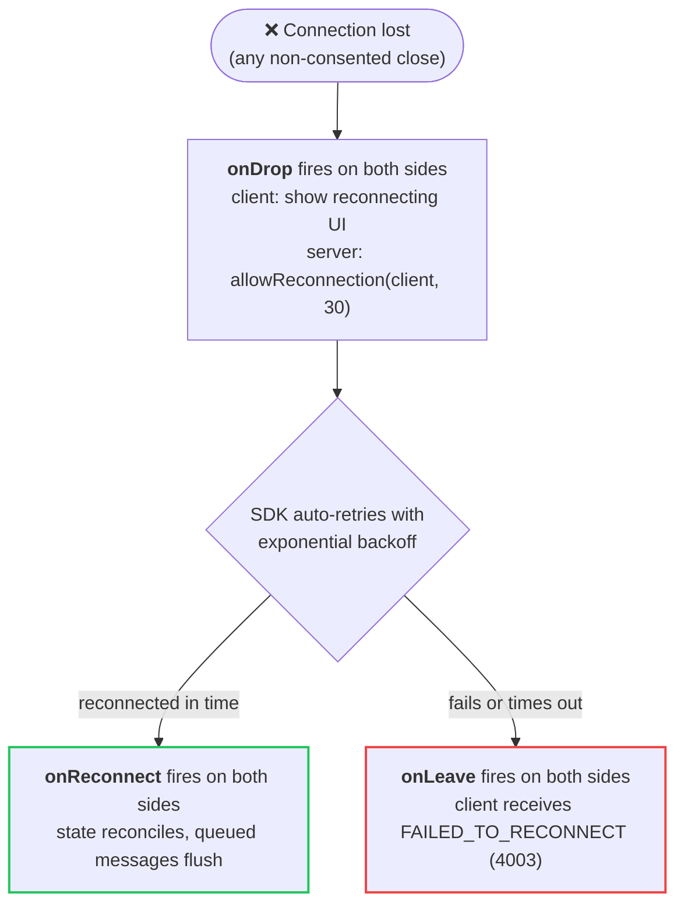

<!-- Generated by tools/sync.mjs from /room, /room/lifecycle, /room/messages, /room/timing-events, /room/reconnection. Do not edit. -->

# Rooms

The `Room` class is the core building block of Colyseus. Each room instance holds one group of clients, who interact through shared state and messages.

## Why Rooms?

- **Isolation** - Players in Room A don't see or interact with players in Room B
- **Encapsulation** - Each room contains its own state, logic, and connected clients
- **Scalability** - Rooms are created on demand and _(optionally)_ disposed when empty
- **Flexibility** - One room class can spawn many instances (e.g., multiple matches of the same game type)

## Defining a Room

You can define a Room using a class that extends `Room`.

**Simple**

```ts filename="MyRoom.ts"
import { Room, Client } from "colyseus";
import { MyState } from "./MyState";

export class MyRoom extends Room {
    state = new MyState();

    onJoin(client: Client, options: any) {
        client.send("welcome", "Welcome to the room!");
    }
}
```

**With Full Type Safety**

You may specify the `metadata`, `state`, and `client` types for full type safety.

```ts filename="MyRoom.ts"
import { Room, type Client as MyClient } from "colyseus";
import { MyState } from "./MyState";

interface MyMetadata {
    difficulty: string;
    rating: number;
}

type Client = MyClient<{
    // specify the shape of outgoing messages to the client
    // so client.send() is type-checked
    // room.onMessage() on the frontend also becomes type-checked
    messages: {
        welcome: string;
    }
}>;

export class MyRoom extends Room<{
    state: MyState,
    metadata: MyMetadata,
    client: Client
}> {
    state = new MyState();

    onCreate(options: MyMetadata) {
        this.metadata = { difficulty: options.difficulty, rating: options.rating };
    }

    onJoin(client: Client, options: any) {
        client.send("welcome", "Welcome to the room!");
    }
}
```

## Room State

Set the synchronizable room state. See [State Synchronization](https://docs.colyseus.io/state.md) and [Schema](https://docs.colyseus.io/state/schema.md) for more details.

```typescript
import { Room } from "colyseus";
import { MyState } from "./MyState";

export class MyRoom extends Room {
    state = new MyState();
}
```

> **Warning:**
>
> The room's `state` is **mutable**. You should not reassign the `state` object, but rather mutate it directly when updating the state.

---

## Message Handling

Rooms have these methods available.

### On Messages

Register handlers to process messages sent by the frontend.

- The `type` argument can be either `string` or `number`.
- You can only define a single handler per message type.

#### Handler for specific type of message

```ts filename="MyRoom.ts"
messages = {
    "action": (client, payload) => {
        console.log(client.sessionId, "sent 'action' message: ", payload);
    }
}
```

> **Note:**
>
> Use `room.send(type, payload)` from the client SDK to send messages to the server.

#### Fallback for all messages

You can register a single handler as a fallback to handle **other** types of messages.

```ts filename="MyRoom.ts"
messages = {
    "action": (client, payload) => {
        //
        // Triggers when 'action' message is sent.
        //
    },

    "*": (client, type, payload) => {
        //
        // Triggers when any other type of message is sent,
        // excluding "action", which has its own specific handler defined above.
        //
        console.log(client.sessionId, "sent", type, payload);
    }
}
```

#### Registering handlers at runtime

The declarative `messages` map covers most cases. You may also register a handler imperatively with `this.onMessage()`. It returns a function that removes the handler when called.

```ts filename="MyRoom.ts"
onCreate() {
    const unbind = this.onMessage("action", (client, payload) => {
        // ...
    });

    // stop handling "action" messages
    unbind();
}
```

Use `this.onMessageBytes()` to receive raw `Uint8Array` messages sent via [`room.sendBytes()`](https://docs.colyseus.io/sdk.md) from the client SDK, skipping the default MsgPack decoding.

```ts filename="MyRoom.ts"
onCreate() {
    this.onMessageBytes("raw-input", (client, bytes) => {
        // bytes is a Uint8Array: decode it yourself
    });
}
```

#### Message input validation

You may provide a validation schema using the `validate()` helper with a Zod schema. If validation fails, the client is disconnected with close code `4002` (`WITH_ERROR`). For a request, the request settles as an error instead.

The validated and typed data will be passed as `payload` on the message handler.

```ts filename="MyRoom.ts"
import { Room, validate } from "colyseus";
import { z } from "zod";

// ...

messages = {
    "action": validate(z.object({
        x: z.number(),
        y: z.number()
    }), (client, payload) => {
        //
        // payload.x and payload.y are guaranteed to be numbers here.
        //
        console.log({ x: payload.x, y: payload.y });
    })
}
```

#### Responding to a message (request/response)

A message handler can **return a value** to answer a client that's waiting for a reply via [`room.request()` or `room.send(type, payload, callback)`](https://docs.colyseus.io/sdk.md#requestresponse). The same handlers serve both plain (fire-and-forget) sends and requests. The return value is sent back only when the client awaited a reply, and ignored otherwise.

```ts filename="MyRoom.ts"
messages = {
    // Return a value (sync or async): it becomes the client's response.
    "get-profile": async (client, { userId }) => {
        return await db.profiles.findById(userId);
    },

    // Throwing (or rejecting) settles the client's request as an error.
    "buy-item": (client, { itemId }) => {
        if (!this.canAfford(client, itemId)) {
            throw new Error("not enough coins");
        }
        return { ok: true };
    },

    // The 3rd argument (ctx) allows deliberate rejections with a typed reason.
    "join-team": (client, { team }, ctx) => {
        if (this.isTeamFull(team)) {
            return ctx.reject({ code: "TEAM_FULL", team });
        }
        return { ok: true };
    },
}
```

- The handler's return value is **awaited** before being sent, so returning a `Promise` works.
- If the handler throws or its `Promise` rejects, the client's request rejects with that error instead of timing out.
- Every handler also receives a third `ctx` argument. Call `ctx.reject(reason)` to settle the request as **rejected**: a deliberate business-logic "no", distinct from an error. On the client, the rejection arrives as an `Error` with `name: "rejected"` and the raw `reason` on its `.reason` property. See [Request/Response on the SDK](https://docs.colyseus.io/sdk.md#requestresponse).
- `ctx.resolve(value)` answers the request explicitly. Use it when the handler must keep working after replying. A plain `return` is equivalent otherwise.
- Only the handler registered for the message's specific type can answer a request. The [`"*"` fallback](#fallback-for-all-messages) is **not** eligible, and a request for a type with no handler rejects with a `no_handler` error.

---

## Lifecycle Events

Rooms expose a hook for every stage a client passes through: `onCreate`,
`onAuth`, `onJoin`, `onDrop`, `onReconnect`, `onLeave`, and `onDispose`, plus
the `devMode` and graceful-shutdown hooks. See
**[Room Lifecycle Events](https://docs.colyseus.io/room/lifecycle.md)** for the full reference.

---

## Room Configuration

### Game Loop

_Optional:_ Set a game loop that can change the state of the game. Default interval: 16.6ms (60fps).

Use **`setTimestep(callback, delay?)`** for a variable-step loop. The callback receives the measured wall-clock `deltaTime`:

```ts filename="MyRoom.ts"
onCreate () {
    this.setTimestep((deltaTime) => this.update(deltaTime));
}

update (deltaTime) {
    // implement your physics or world updates here!
    // this is a good place to update the room state
}
```

> **Note:**
>
> `setSimulationInterval()` is the previous name for `setTimestep()` and still works (it forwards). For **client-predicted** games, use the fixed-step loop **`setFixedTimestep(step, tickRate)`** instead. It advances by a constant `dt` and advertises the rate to predicting clients, which a variable step can't do deterministically. See [Server Input & Fixed Timestep](https://docs.colyseus.io/netcode/server-input.md).

---

### Visibility & Access

Three flags (`locked`, `private`, and `unlisted`) control who can find and
join a room, alongside `lock()`, `unlock()`, and `setMatchmaking()`. See
**[Room Visibility & Access](https://docs.colyseus.io/matchmaker/visibility.md)** for the full reference.

---

### Configuration Properties

| Property | Default | Description |
|----------|---------|-------------|
| `maxClients` | `Infinity` | Maximum number of clients allowed. Room is auto-locked when full. |
| `patchRate` | `50` | Frequency to send state updates to clients, in milliseconds (20fps). |
| `autoDispose` | `true` | Automatically dispose the room when last client disconnects. |
| `maxMessagesPerSecond` | `Infinity` | Maximum messages a client can send per second. Exceeding disconnects the client. |
| `seatReservationTimeout` | `15` | Seconds to wait for a client to effectively join after reserving a seat. |
| `locked` | _(read-only)_ | Whether the room is currently locked (via `maxClients` or `lock()`). |

---

## Communication

### Broadcast Message

Send a message to all connected clients.

Available options are:

- **`except`**: a [`Client`](https://docs.colyseus.io/room.md#client-instance), or array of `Client` instances not to send the message to
- **`afterNextPatch`**: waits until next patch to broadcast the message

**Broadcast to all**

Broadcasting a message to all clients:

```ts filename="MyRoom.ts"
messages = {
    "action": (client, payload) => {
        // broadcast a message to all clients
        this.broadcast("action-taken", "an action has been taken!");
    }
}
```

**Broadcast except for sender**

Broadcasting a message to all clients, except the sender.

```ts filename="MyRoom.ts"
messages = {
    "fire": (client, payload) => {
        // sends "fire" event to every client, except the one who triggered it.
        this.broadcast("fire", payload, { except: client });
    }
}
```

**Broadcast after state patch**

Broadcasting a message to all clients, only after a change in the state has been applied:

```ts filename="MyRoom.ts"
messages = {
    "destroy": (client, payload) => {
        // perform changes in your state!
        this.state.destroySomething();

        // this message will arrive only after new state has been applied
        this.broadcast("destroy", "something has been destroyed", { afterNextPatch: true });
    }
}
```

> **Note:**
>
> The client will receive the message in the [`onMessage()`](https://docs.colyseus.io/sdk.md#receiving-messages) callback.

---

### Broadcast Message (in bytes)

Send a raw byte array to all connected clients, skipping the default MsgPack encoding. The counterpart of [`client.sendBytes()`](#send-message-in-bytes) for broadcasts.

```ts filename="MyRoom.ts"
this.broadcastBytes("raw-update", new Uint8Array([ 1, 2, 3 ]), { except: client });
```

---

### Has Reached Max Clients

Returns whether the sum of connected clients and reserved seats exceeds the maximum number of clients.

```ts filename="MyRoom.ts"
onCreate(options) {
    if (this.hasReachedMaxClients()) {
        console.log("Room is full!");
    }
}
```

---

### Has Reserved Seat

Returns whether a seat reservation exists for the given `sessionId`: reserved but not yet consumed, or held for a [reconnection](https://docs.colyseus.io/room/reconnection.md). Pass the client's `reconnectionToken` as the second argument to check a reconnection reservation specifically.

```ts filename="MyRoom.ts"
if (this.hasReservedSeat(sessionId)) {
    // a client with this sessionId is expected to join
}
```

---

### Disconnect

Disconnect all clients, then dispose of the room. Returns a `Promise` that resolves when every client has been disconnected.

The optional `closeCode` is delivered to each client's [`onLeave` listener](https://docs.colyseus.io/sdk/connection.md#leaving-a-room). The default is `CONSENTED` (`4000`); custom application codes use `4011`–`4999`. See the [close-code table](#table-of-websocket-close-codes).

```ts filename="MyRoom.ts"
// disconnect all clients, then dispose of the room
await this.disconnect();

// same, with a custom close code
await this.disconnect(4020);
```

---

### Broadcast Patch

> **Warning:**
>
> **You may not need this!** - This method is called automatically by the framework.

This method will check whether mutations have occurred in the `state`, and broadcast them to all connected clients.

If you'd like to have control over when to broadcast patches, you can do this by disabling the default patch interval:

```ts filename="MyRoom.ts"
// disable automatic patches
patchRate = null;

onCreate() {
    this.clock.setInterval(() => {
        // only broadcast patches if your custom conditions are met.
        if (yourCondition) {
            this.broadcastPatch();
        }
    }, 2000);
}
```

---

## Reconnection

`allowReconnection()` lets a dropped client return to the room within a time
window, or under manual control. See **[Reconnection](https://docs.colyseus.io/room/reconnection.md)** for
the full server-side and client-side reference.

---

## Room Properties

### `roomId`

The unique identifier of the room. By default, a random 9-character-long string is assigned as the Room ID.

> **Note:**
>
> You may customize the Room ID during `onCreate()` by setting the `this.roomId` property. See [Recipes &raquo; Customize Room ID](https://docs.colyseus.io/recipes/custom-room-id.md)

---

### `roomName`

The name of the room you provided in the `rooms` configuration of [`defineServer()`](https://docs.colyseus.io/server.md#define-room-type).

---

### `state`

The synchronized state of the room.

> **Note:**
>
> See [State Synchronization](https://docs.colyseus.io/state.md).

---

### `metadata`

The room's matchmaking metadata. This data is used to filter rooms during matchmaking queries.

```ts filename="MyRoom.ts"
// Get metadata
console.log(this.metadata.difficulty);

// Set metadata during onCreate() only
onCreate(options) {
    this.metadata = { difficulty: "hard", rating: 1500 };
}
```

> **Warning:**
>
> The `metadata` setter can only be used during `onCreate()`. To update metadata after the room is created, use [`setMetadata()`](https://docs.colyseus.io/matchmaker/visibility.md#matchmaking-properties) or [`setMatchmaking()`](https://docs.colyseus.io/matchmaker/visibility.md#matchmaking-properties) instead.

---

### `clients`

The array of connected clients. See [Client Instance](#client-instance).

#### Sending a message to a specific client

```ts filename="MyRoom.ts"
// ...
this.clients.forEach((client) => {
    if (client.userData.team === "red") {
        client.send("hello", "world");
    }
});
// ...
```

#### Getting a client by `sessionId`.

```ts filename="MyRoom.ts"
// ...
const client = this.clients.get("UEsBFUBhK");
// ...
```

---

### `clock`

The `clock` provides timing controls that automatically clean up when the room is disposed, preventing memory leaks. Use it instead of `setTimeout` and `setInterval`.

```ts filename="MyRoom.ts"
// ...
onCreate() {
    this.clock.setTimeout(() => {
        console.log("This message will be printed after 5 seconds");
    }, 5000);

    this.clock.setInterval(() => {
        console.log("Current time:", this.clock.currentTime);
    }, 1000);
}
// ...
```

> **Note:**
>
> See [Timing Events](https://docs.colyseus.io/room/timing-events.md).

---

### `presence`

The `presence` is used as a shared in-memory database for your cluster, and for pub/sub operations between rooms.

```ts filename="MyRoom.ts"
// ...
onCreate() {
    // publish an event to all rooms listening to "event-from-another-room"
    this.presence.publish("event-name-from-another-room", { hello: "world" });

    // subscribe to events from another room
    this.presence.subscribe("event-name-from-another-room", (payload) => {
        console.log("Received event from another room!", payload);
    });

    // set arbitrary value to the presence
    this.presence.set("arbitrary-key", "value");
}
// ...
```

> **Note:**
>
> See [Presence API](https://docs.colyseus.io/server/presence.md).

---

## Client Instance

The `client` instance from the backend is responsible for the **transport** layer between the server and the client. Do not confuse it with the [`Client` from the frontend SDK](https://docs.colyseus.io/sdk.md), as they have completely different purposes.

You operate on `client` instances from [`this.clients`](#clients), [`Room#onJoin()`](https://docs.colyseus.io/room/lifecycle.md#on-join), [`Room#onLeave()`](https://docs.colyseus.io/room/lifecycle.md#on-leave) and [`Room#onMessage()`](#on-messages).

### Properties

#### `sessionId`

Unique identifier of the client connection.

```ts filename="MyRoom.ts"
// ...
onJoin(client, options) {
    console.log(client.sessionId);
}
// ...
```

> **Note:**
>
> In the frontend, you can find the [`sessionId` in the `room` instance](https://docs.colyseus.io/sdk.md#room-reference).

---

#### `userData`

The `client.userData` can be used to store player-specific data easily accessible via the `client` instance. This property is meant for convenience.

```ts filename="MyRoom.ts"
// ...
onJoin(client, options) {
  client.userData = { team: (this.clients.length % 2 === 0) ? "red" : "blue" };
}
onLeave(client)  {
  console.log(client.userData.team);
}
// ...
```

---

#### `auth`

The `client.auth` property holds the data returned by the [`onAuth()`](https://docs.colyseus.io/room/lifecycle.md#on-auth) method.

```ts filename="MyRoom.ts"
onAuth(client, options, context) {
    return { userId: "123" };
}

onJoin(client, options) {
    console.log(client.auth.userId);
}
```

> **Note:**
>
> See [Authentication](https://docs.colyseus.io/auth.md) for more details.

---

#### `view`

The `client.view` property is used for state filtering - allowing you to control which parts of the state a client can see.

```ts filename="MyRoom.ts"
import { StateView } from "@colyseus/schema";

onJoin(client, options) {
    // Set the client's view to filter portions of the state they receive
    client.view = new StateView();
}
```

> **Note:**
>
> See [ State Synchronization → State View](https://docs.colyseus.io/state/view.md) for more details.

---

#### `reconnectionToken`

The unique token used for reconnection. This token is regenerated each time the client connects.

```ts filename="MyRoom.ts"
onJoin(client, options) {
    console.log(client.reconnectionToken);
}
```

---

### Methods

#### Send Message

Send a type of message to the client. Messages are encoded with MsgPack and can hold any JSON-serializable data structure.

The `type` can be either a `string` or a `number`.

```ts filename="MyRoom.ts"
//
// sending message of string type ("powerup")
//
client.send("powerup", { kind: "ammo" });

//
// sending message of number type (1)
//
client.send(1, { kind: "ammo"});
```

> **Note:**
>
> [See how to handle `onMessage` from the frontend SDK](https://docs.colyseus.io/sdk.md#receiving-messages)

---

#### Send Message (in bytes)

Send a raw byte array message to the client.

The `type` can be either a `string` or a `number`.

This method is useful if you'd like to manually encode a message, rather than the default encoding (MsgPack).

```ts filename="MyRoom.ts"
//
// sending message of string type ("powerup")
//
client.sendBytes("powerup", new Uint8Array([ 172, 72, 101, 108, 108, 111, 32, 119, 111, 114, 108, 100, 33 ]));

//
// sending message of number type (1)
//
client.sendBytes(1, new Uint8Array([ 172, 72, 101, 108, 108, 111, 32, 119, 111, 114, 108, 100, 33 ]));
```

---

#### Leave Room

Force disconnection of the `client` with the room. You may send a custom `code` when closing the connection, with values between `4011` and `4999`. Codes `4000`–`4010` are reserved by the framework. See the [table of WebSocket close codes](#table-of-websocket-close-codes) below.

```ts filename="MyRoom.ts"
// disconnect this client with the default code (4000, CONSENTED)
client.leave();

// disconnect this client with a custom code
client.leave(4020);
```

> **Note:**
>
> This call will trigger the [`room.onLeave`](https://docs.colyseus.io/sdk/connection.md#leaving-a-room) event on the frontend.

#### Table of WebSocket close codes

| Close code (uint16) | Codename               | Internal | Customizable | Description |
|---------------------|------------------------|----------|--------------|-------------|
| `0` - `999`             |                        | Yes      | No           | Unused |
| `1000`                | `NORMAL_CLOSURE`         | No       | No           | Successful operation / regular socket shutdown |
| `1001`                | `GOING_AWAY`     | No       | No           | Client is leaving (browser tab closing) |
| `1002`                | *Protocol error* | Yes      | No           | Endpoint received a malformed frame |
| `1003`                | *Unsupported frame*    | Yes      | No           | Endpoint received an unsupported frame (e.g. binary-only endpoint received text frame) |
| `1004`                |                        | Yes      | No           | Reserved |
| `1005`                | `NO_STATUS_RECEIVED`     | Yes      | No           | Expected close status, received none |
| `1006`                | `ABNORMAL_CLOSURE`       | Yes      | No           | No close code frame has been received |
| `1007`                | *Unsupported payload*  | Yes      | No           | Endpoint received inconsistent message (e.g. malformed UTF-8) |
| `1008`                | *Policy violation*     | No       | No           | Generic code used for situations other than 1003 and 1009 |
| `1009`                | *Frame too large*      | No       | No           | Endpoint won't process large frame |
| `1010`                | *Mandatory extension*  | No       | No           | Client wanted an extension which server did not negotiate |
| `1011`                | *Server error*         | No       | No           | Internal server error while operating |
| `1012`                | *Service restart*      | No       | No           | Server/service is restarting |
| `1013`                | *Try again later*      | No       | No           | Temporary server condition forced blocking client's request |
| `1014`                | *Bad gateway*          | No       | No           | Server acting as gateway received an invalid response |
| `1015`                | *TLS handshake fail*   | Yes      | No           | Transport Layer Security handshake failure |
| `1016` - `1999`         |                        | Yes      | No           | Reserved for future use by the WebSocket standard. |
| `2000` - `2999`         |                        | Yes      | Yes          | Reserved for use by WebSocket extensions |
| `3000` - `3999`         |                        | No       | Yes          | 	Available for use by libraries and frameworks. May not be used by applications. Available for registration at the IANA via first-come, first-serve. |
| `4000`                | `CONSENTED`            | No       | No           | Client left intentionally (`room.leave()`) |
| `4001`                | `SERVER_SHUTDOWN`      | No       | No           | Server graceful shutdown (production) |
| `4002`                | `WITH_ERROR`           | No       | No           | Closed due to an error |
| `4003`                | `FAILED_TO_RECONNECT`  | No       | No           | All reconnection attempts failed, or the server denied/failed the reconnection |
| `4010`                | `MAY_TRY_RECONNECT`   | No       | No           | Server shutdown in dev mode (allows reconnect) |
| `4011` - `4999` |              | No       | Yes          | Available for applications |

---

## Built-in Rooms

Colyseus ships pre-built room types you can use directly or extend. Lobby and
Queue are documented under Matchmaking, since that's the job they do:

- [Lobby Room](https://docs.colyseus.io/matchmaker/lobby.md): A live listing of available rooms, the backend for a room browser UI.
- [Queue Room](https://docs.colyseus.io/matchmaker/queue.md): A matchmaking queue that groups players over time and spawns a match room when a group is ready.
- [Relay Room](https://docs.colyseus.io/room/relay.md): A lightweight relay that broadcasts client messages to everyone else, with no authoritative state.

## Next Steps

- [State Synchronization](https://docs.colyseus.io/state.md) - Learn how to define and synchronize room state
- [Server Configuration](https://docs.colyseus.io/server.md) - Configure your Colyseus server
- [Timing Events](https://docs.colyseus.io/room/timing-events.md) - Schedule delayed and recurring events

---
Source: https://docs.colyseus.io/room

# Room Lifecycle Events

These hooks are called automatically, in the order a client moves through the
room: created, authenticated, joined, dropped, reconnected, left, disposed.
[`async`/`await`](https://developer.mozilla.org/en-US/docs/Web/JavaScript/Reference/Statements/async_function)
is supported in all of them.

The room's lifecycle events are called automatically. [`async`/`await`](https://developer.mozilla.org/en-US/docs/Web/JavaScript/Reference/Statements/async_function) is supported in all of them.

**TypeScript**

```ts filename="MyRoom.ts"
import { Room, Client, AuthContext } from "colyseus";

export class MyRoom extends Room {
    // (optional) Validate client auth token before joining/creating the room
    onAuth (client: Client, options: any, context: AuthContext) { }

    // When room is initialized
    onCreate (options: any) { }

    // When the client successfully joins the room
    onJoin (client: Client, options: any, auth: any) { }

    // When a client disconnects unexpectedly (use allowReconnection here)
    onDrop (client: Client, code?: number) { }

    // When a client successfully reconnects
    onReconnect (client: Client) { }

    // When a client effectively leaves the room
    onLeave (client: Client, code?: number) { }

    // Cleanup callback, called after there are no more clients in the room. (see `autoDispose`)
    onDispose () { }
}
```

**JavaScript**

```js filename="MyRoom.js"
import { Room } from "colyseus";

export class MyRoom extends Room {
    // (optional) Validate client auth token before joining/creating the room
    onAuth (client, options, context) { }

    // When room is initialized
    onCreate (options) { }

    // When the client successfully joins the room
    onJoin (client, options, auth) { }

    // When a client disconnects unexpectedly (use allowReconnection here)
    onDrop (client, code) { }

    // When a client successfully reconnects
    onReconnect (client) { }

    // When a client effectively leaves the room
    onLeave (client, code) { }

    // Cleanup callback, called after there are no more clients in the room. (see `autoDispose`)
    onDispose () { }
}
```

## On Create

Called once, when the room is created by the matchmaker. `options` is the merged values specified on [`defineRoom()`](https://docs.colyseus.io/server.md#define-room-type) with the options provided from the SDK at [`.joinOrCreate()`](https://docs.colyseus.io/sdk.md#join-or-create-recommended) or [`.join()`](https://docs.colyseus.io/sdk.md#other-join-methods).

```ts filename="MyRoom.ts"
onCreate (options) {
    /**
     * This is a good place to initialize your room state.
     */
}
```

The server may overwrite options in [`defineRoom()`](https://docs.colyseus.io/server.md#define-room-type) for authority over client-provided options:

**Backend**

```ts filename="app.config.ts"
// (backend)
const server = defineServer({
  rooms: {
    my_room: defineRoom(MyRoom, { map: "cs_assault" })
  }
})
```

**Frontend**

The `options` argument is provided by the client upon room creation:

```js filename="client.js"
// (frontend - using the javascript sdk)
// ...
client.joinOrCreate("my_room", {
    name: "Jake",
    map: "de_dust2"
})
```

On this example, the `map` option is `"cs_assault"` during `onCreate()`, and `"de_dust2"` during `onJoin()`.

---

## On Auth

The `onAuth` method is called before `onJoin`, and it is responsible for validating the client's request to join a room.

**Instance onAuth**

```ts filename="MyRoom.ts"
async onAuth (client, options, context) {
    /**
     * This is a good place to validate the client's auth token.
     */
}
```
    **Arguments**
    - `client`: A reference to the client that is trying to join the room.
    - `options`: Options provided by the frontend SDK.
    - `context`: The request context, containing:
        - `.token` - the authentication token sent by the client.
        - `.headers` - the headers sent by the client.
        - `.ip` - the IP address of the client.

**Static onAuth**

```ts filename="MyRoom.ts"
static async onAuth (token, options, context) {
    /**
     * This is a good place to validate the client's auth token.
     */
}
```
    **Arguments**
    - `token`: The authentication token sent by the client.
    - `options`: Options provided by the frontend SDK.
    - `context`: The request context, containing:
        - `.token` - the authentication token sent by the client.
        - `.headers` - the headers sent by the client.
        - `.ip` - the IP address of the client.

> **Note:**
>
> See [Authentication](https://docs.colyseus.io/auth/room.md) for more details.

---

## On Join

Triggered when a client successfully joins the room, after a successful `onAuth`.

**Parameters:**

- `client`: A reference to the client that joined the room.
- `options`: Options provided by the Client SDK. _(Merged with default values provided by [Server#define()](https://docs.colyseus.io/server.md#define-room-type))_
- `auth`: _(optional)_ auth data returned by [`onAuth`](#on-auth) method.

```ts filename="MyRoom.ts"
async onJoin (client, options, auth?) {
    /**
     * This is a good place to add the client to the state.
     */
}
```

> **Note:**
>
> See Client SDK on [`.joinOrCreate()`](https://docs.colyseus.io/sdk.md#join-or-create-recommended) and [`.join()`](https://docs.colyseus.io/sdk.md#other-join-methods).

---

## On Drop

> **Note:**
>
> New in 0.17. See [Automatic Reconnection](https://docs.colyseus.io/room/reconnection.md) for more details.

Triggered when a client disconnects unexpectedly (without consent). This hook is the recommended place to use `allowReconnection()`.

**Parameters:**

- `client`: The client that was dropped from the room.
- `code`: _(optional)_ The close code of the leave event.

```ts filename="MyRoom.ts"
async onDrop (client, code) {
    await this.allowReconnection(client, 20);
}
```

> **Note:**
>
> If `onDrop` is not defined, `onLeave` will be called for both consented and non-consented disconnections.

---

## On Reconnect

> **Note:**
>
> New in 0.17. See [Automatic Reconnection](https://docs.colyseus.io/room/reconnection.md) for more details.

Triggered when a client successfully reconnects to the room after calling `allowReconnection()`.

**Parameters:**

- `client`: The client that reconnected to the room.

```ts filename="MyRoom.ts"
onReconnect (client) {
    /**
     * Client has reconnected successfully.
     */
    console.log(client.sessionId, "reconnected!");
}
```

---

## On Leave

Triggered when a client effectively leaves the room.

- If `onDrop` is defined: `onLeave` is called for consented disconnections (client called `.leave()`), and also after a drop once reconnection fails, times out, or was not allowed.
- If `onDrop` is not defined: `onLeave` is called for both consented and non-consented disconnections.

**Parameters:**

- `client`: The client that left the room.
- `code`: _(optional)_ The close code of the leave event.

```ts filename="MyRoom.ts"
async onLeave (client, code) {
    /**
     * This is a good place to remove the client from the state.
     */
}
```

You may define this function as `async`:

**Synchronous**

``` typescript
onLeave(client, code) {
    if (this.state.players.has(client.sessionId)) {
        this.state.players.delete(client.sessionId);
    }
}
```

**Asynchronous**

``` typescript
async onLeave(client, code) {
    const player = this.state.players.get(client.sessionId);
    await persistUserOnDatabase(player);
}
```

> **Note:**
>
> At [Graceful Shutdown](https://docs.colyseus.io/server/graceful-shutdown.md), `onLeave` is called with `code = CloseCode.SERVER_SHUTDOWN` for all clients.

---

## On Dispose

The `onDispose()` method is called before the room is destroyed, which happens when:

- there are no more clients left in the room, and `autoDispose` is set to `true` (default)
- you manually call [`.disconnect()`](https://docs.colyseus.io/room.md#disconnect).

```ts filename="MyRoom.ts"
async onDispose() {
    /**
     * This is a good place to perform cleanup tasks.
     */
}
```

You may define `async onDispose()` an asynchronous method in order to persist some data in the database. In fact, this is a great place to persist player's data in the database after a game match ends.

> **Note:**
>
> At [Graceful Shutdown](https://docs.colyseus.io/server/graceful-shutdown.md), `onDispose` is called for all rooms.

---

## On Unhandled Exception

Opt-in to catch unhandled exceptions in your room. This method is called when an unhandled exception occurs in any of the lifecycle methods.

```ts filename="MyRoom.ts"
onUncaughtException (err: Error, methodName: string) {
    console.error("An error occurred in", methodName, ":", err);
    err.cause // original unhandled error
    err.message // original error message
}
```

> **Note:**
>
> See [Exception Handling](https://docs.colyseus.io/room/exception-handling.md) for more details.

---

## On Before Patch

The `onBeforePatch` lifecycle hook is triggered before state synchronization, at patch rate frequency. (see [`patchRate`](https://docs.colyseus.io/room.md#configuration-properties))

```ts filename="MyRoom.ts"
onBeforePatch(state) {
    /*
     * Here you can mutate something in the state just before it is encoded &
     * synchronized with all clients
     */
}
```

---

## On Cache Room (`devMode`)

An optional hook to cache external data when [`devMode`](https://docs.colyseus.io/server/devmode.md) is enabled.
(See [restoring data outside the room's state](https://docs.colyseus.io/server/devmode.md#restoring-external-data))

```ts filename="MyRoom.ts"
export class MyRoom extends Room {
  // ...

  onCacheRoom() {
    return { foo: "bar" };
  }
}
```

---

## On Restore Room (`devMode`)

An optional hook to reprocess/restore data which was returned and stored from the previous hook [`onCacheRoom`](#on-cache-room-devmode) when [Development Mode](https://docs.colyseus.io/server/devmode.md) is enabled.

```ts filename="MyRoom.ts"
export class MyRoom extends Room {
  // ...

  onRestoreRoom(cachedData: any): void {
    console.log("ROOM HAS BEEN RESTORED!", cachedData);

    this.state.players.forEach(player => {
      player.method(cachedData["foo"]);
    });
  }
}
```

> **Note:**
>
> See [Restoring data outside the room's `state`](https://docs.colyseus.io/server/devmode.md#restoring-external-data)

---

## On Before Shutdown

The `onBeforeShutdown` lifecycle hook is called as part of the [Graceful Shutdown](https://docs.colyseus.io/server/graceful-shutdown.md) process. The process will only truly shutdown after all rooms have been disposed.

By default, the room will disconnect all clients and dispose itself immediately.

You may customize how the room should behave during the shutdown process:

```ts filename="MyRoom.ts"
onBeforeShutdown() {
    //
    // Notify users that process is shutting down, they may need to save their progress and join a new room
    //
    this.broadcast("going-down", "Server is shutting down. Please save your progress and join a new room.");

    //
    // Disconnect all clients after 5 minutes
    //
    this.clock.setTimeout(() => this.disconnect(), 5 * 60 * 1000);
}
```

> **Note:**
>
> See [graceful shutdown](https://docs.colyseus.io/server/graceful-shutdown.md) for more details.

---
Source: https://docs.colyseus.io/room/lifecycle

# Message Composability

The `Messages<R>` type allows you to define reusable, type-safe message handlers that can be composed and spread into your Room's `messages` property. This pattern is useful for:

- **Code reuse**: Share common message handlers across multiple rooms
- **Modularity**: Organize handlers into separate files or modules
- **Third-party libraries**: Create and distribute reusable message handler packages

> **Note:**
>
> This pattern requires TypeScript for full type-safety.

## Defining Reusable Message Handlers

Use the `Messages<R>` generic type to define a set of message handlers outside of your Room class. The generic parameter `R` should be your Room class to ensure proper typing for `this` context.

```typescript filename="thirdPartyMessages.ts"
import { Room, validate, type Client, type Messages } from "colyseus";
import { z } from "zod";
import { MyRoom } from "./MyRoom";

// Define a custom client type if needed
type MyClient = Client<{ userData: { name: string } }>;

export const thirdPartyMessages: Messages<MyRoom> = {
  // Handler with validation
  chat: validate(
    z.object({
      text: z.string().max(500),
    }),
    function (client: MyClient, message) {
      // message.text is guaranteed to be a string (max 500 chars)
      this.broadcast("chat", {
        sender: client.sessionId,
        text: message.text,
      });
    }
  ),
};
```

> **Warning:**
>
> When using `validate()` with the `Messages<R>` type, an arrow function won't give you access to `this` (the Room instance). Use a regular `function` expression instead.

## Composing Messages in Your Room

Use the spread operator to compose multiple message handler objects into your Room's `messages` property:

```typescript filename="MyRoom.ts"
import { Room, Client, validate } from "colyseus";
import { z } from "zod";
import { thirdPartyMessages } from "./thirdPartyMessages";
import { MyRoomState } from "./MyRoomState";

type MyClient = Client<{ userData: { name: string } }>;

export class MyRoom extends Room<{ client: MyClient }> {
  state = new MyRoomState();

  messages = {
    // Spread reusable handlers from external modules
    ...thirdPartyMessages,

    // Define room-specific handlers with validation
    move: validate(
      z.object({
        x: z.number(),
        y: z.number(),
        z: z.number().optional(),
      }),
      (client, message) => {
        const player = this.state.players.get(client.sessionId)!;
        player.x = message.x;
        player.y = message.y;
      }
    ),

    // Simple handler defined inline
    notify_something: (client: MyClient, message: any) => {
      this.broadcast("notify", { sessionId: client.sessionId, message: "I'm a notification!" });
    },
  };
}
```

## Overriding Composed Handlers

When spreading multiple handler objects, handlers defined later will override earlier ones with the same name:

```typescript filename="MyRoom.ts"
messages = {
  ...thirdPartyMessages,  // Contains "chat" handler
  
  // This overrides the "chat" handler from thirdPartyMessages
  chat: validate(
    z.object({ text: z.string() }),
    (client, message) => {
      // Custom chat implementation
    }
  ),
};
```

## See Also

- [Room - Message Handling](https://docs.colyseus.io/room.md#message-handling) - Basic message handler syntax
- [Room - Message Input Validation](https://docs.colyseus.io/room.md#message-input-validation) - Using `validate()` with Zod schemas

---
Source: https://docs.colyseus.io/room/messages

# Timing Events

For [timing events](https://www.w3.org/TR/2011/WD-html5-20110525/timers.html),
it's recommended to use the [`this.clock`](https://docs.colyseus.io/room.md#clock) methods,
from your `Room` instance.

> **Note:**
>
> All intervals and timeouts registered on [`this.clock`](https://docs.colyseus.io/room.md#clock) are cleared automatically when the `Room` is disposed.

> **Warning:**
>
> The built-in [`setTimeout`](https://developer.mozilla.org/en-US/docs/Web/API/WindowOrWorkerGlobalScope/setTimeout) and [`setInterval`](https://developer.mozilla.org/en-US/docs/Web/API/WindowOrWorkerGlobalScope/setInterval) methods are affected by CPU load. Under load they can fire much later than requested.

## Clock

The clock is provided as a useful mechanism to time events outside of a stateful simulation. An example use case could be: when a player collects an item you might `clock.setTimeout(...)` to create a new collectible. One advantage of `this.clock` is that you do not have to track room updates and deltas. You can instead time your events independently of the room state.

### Clock Methods

*Note: `time` parameters are in milliseconds*

#### `clock.setInterval(callback, time, ...args): Delayed`

The `setInterval()` method repeatedly calls a function or executes a code
snippet, with a fixed time delay between each call. It returns
[`Delayed`](#delayed) instance which identifies the interval, so you can
manipulate it later.

#### `clock.setTimeout(callback, time, ...args): Delayed`

The `setTimeout()` method sets a timer which executes a function or specified
piece of code once after the timer expires. It returns [`Delayed`](#delayed)
instance which identifies the interval, so you can manipulate it later.

**Example**

The example below shows a Room with `setInterval()`, `setTimeout`, and clearing a previously stored instance of type `Delayed`. The example also reads `currentTime` from the Room's clock instance.

After 1 second 'Time now ' + `this.clock.currentTime` is `console.log`'d, and then after 10 seconds we clear the interval via `this.delayedInterval.clear()`

```ts filename="MyRoom.ts"
// Import Delayed
import { Room, Client, Delayed } from "colyseus";

export class MyRoom extends Room {
    // For this example
    public delayedInterval!: Delayed;

    // When room is initialized
    onCreate(options: any) {
        // start the clock ticking
        this.clock.start();

        // Set an interval and store a reference to it
        // so that we may clear it later
        this.delayedInterval = this.clock.setInterval(() => {
            console.log("Time now " + this.clock.currentTime);
        }, 1000);

        // After 10 seconds clear the timeout;
        // this will *stop and destroy* the timeout completely
        this.clock.setTimeout(() => {
            this.delayedInterval.clear();
        }, 10000);
    }
}
```

#### `clock.clear()`

Clear all intervals and timeouts registered with `clock.setInterval()` and `clock.setTimeout()`.

#### `clock.start()`

Start counting time.

#### `clock.stop()`

Stop counting time.

#### `clock.tick()`

This method is called automatically at every timestep. All
`Delayed` instances are checked during `tick`.

> **Note:**
>
> See [Room#setTimestep()](https://docs.colyseus.io/room.md#game-loop) for more details.

### Clock Properties

#### `clock.elapsedTime`

Elapsed time in milliseconds since [`clock.start()`](#clockstart) method was called. Read only.

#### `clock.currentTime`

Current time in milliseconds. Read only.

#### `clock.deltaTime`

The difference in milliseconds between the last and current `clock.tick()` call. Read only.

## Delayed

Delayed instances are created from
[`clock.setInterval()`](#clocksetintervalcallback-time-args-delayed) or
[`clock.setTimeout()`](#clocksettimeoutcallback-time-args-delayed) methods.

### Public methods

#### `delayed.pause()`

Pause the time of a particular `Delayed` instance. (`elapsedTime` is not going to increase until `.resume()` is called.)

#### `delayed.resume()`

Resumes the time of a particular `Delayed` instance. (`elapsedTime` is going to continue to increase normally)

#### `delayed.clear()`

Clears the timeout or interval.

#### `delayed.reset()`

Reset the elapsed time.

### Public properties

#### `delayed.elapsedTime: number`

Elapsed time of the `Delayed` instance, in milliseconds since started.

#### `delayed.active: boolean`

Returns `true` if timer is still running.

#### `delayed.paused: boolean`

Returns `true` if timer has been paused via `.pause()`.

---
Source: https://docs.colyseus.io/room/timing-events

# Reconnection

Colyseus supports two complementary reconnection flows. Both require the server to hold the client's seat via [`allowReconnection()`](#allowreconnectionclient-seconds):

- **[Automatic reconnection](#automatic-reconnection)**: the SDK detects the drop and retries with exponential backoff. The same `room` instance survives, so your listeners stay attached. Introduced in version 0.17.
- **[Manual reconnection](#manual-reconnection)**: the client rejoins later by calling `client.reconnect()` with a stored `reconnectionToken`. Use it when the app itself restarts (a page reload, an app switch on mobile) or after automatic retries give up. Available in all versions.

## Overview

When a client loses connection unexpectedly (e.g., network switch, temporary connectivity loss), the automatic flow works as follows:

1. **Client detects disconnection** → `onDrop()` is triggered on the client
2. **Server detects disconnection** → `onDrop()` is triggered on the server (if defined)
3. **Server allows reconnection** → Call `allowReconnection()` inside `onDrop()`
4. **Client attempts to reconnect** → Automatic retry with exponential backoff
5. **Reconnection succeeds** → `onReconnect()` is triggered on both client and server
6. **If reconnection fails/times out** → `onLeave()` is triggered on both sides



The automatic flow only covers drops the running client can recover from. A page reload or app restart destroys the client-side `room` object, so the SDK cannot retry by itself. In that case the client calls [`client.reconnect()`](#manual-reconnection) with a stored token instead. The server-side flow is identical.

---

## Server-Side

The backend handles both flows identically.

### `onDrop(client, code)`

Called when a client disconnects **without consent** (abnormal closure, network issues, etc.). This hook is where you should call `allowReconnection()` to allow the client to reconnect.

> **Note:**
>
> `onDrop()` is **optional**, but recommended for code clarity. You may implement the same functionality directly inside `onLeave()` by checking if the close code is `CloseCode.CONSENTED`. See [the alternative pattern](#alternative-handling-reconnection-in-onleave).

```typescript
import { Room, Client, CloseCode } from "colyseus";

class MyRoom extends Room {
  onDrop(client: Client, code: number) {
    // Allow the client to reconnect within 30 seconds
    this.allowReconnection(client, 30);

    // Optionally mark the player as disconnected in your state
    const player = this.state.players.get(client.sessionId);
    if (player) {
      player.connected = false;
    }
  }
}
```

**When `onDrop()` is called:** every non-consented disconnection. Abnormal closures (1006), browser/tab closed (1001), no close status (1005), dev-mode restarts (4010), server errors (4002), and custom close codes all qualify.

**When `onDrop()` is NOT called (goes directly to `onLeave()`):**
- `CloseCode.CONSENTED` (4000): Client called `room.leave()` with consent
- A reconnection already in progress was denied or failed

### `allowReconnection(client, seconds)`

Call this method inside `onDrop()` to hold the client's seat. The reservation covers both the SDK's automatic retries and a later manual `client.reconnect()`.

```typescript
// Allow reconnection for 30 seconds
this.allowReconnection(client, 30);

// Allow reconnection indefinitely (manual mode)
const reconnection = this.allowReconnection(client, "manual");

// Later, you can reject the reconnection manually
reconnection.reject();
```

**Returns:** A `Deferred<Client>` promise that resolves when the client reconnects or rejects if the timeout expires. Calling it without `await` is safe. The framework handles the timeout internally and routes the outcome to `onReconnect()` or `onLeave()`. Only `await` it inside a `try`/`catch`, as in [the `onLeave()` pattern below](#alternative-handling-reconnection-in-onleave).

**Choosing the window:** with a number of `seconds`, the seat expires by itself. With `"manual"`, the seat is held until your code calls `.reject()`. Manual mode suits players returning after a page reload or a long app switch. Pair it with your own give-up logic:

```typescript
onDrop(client: Client, code: number) {
  const reconnection = this.allowReconnection(client, "manual");
  const currentRound = this.state.currentRound;

  // In a real project, store `reconnection` on your Player instance and
  // perform this check from your game loop instead.
  client.userData.reconnectionInterval = this.clock.setInterval(() => {
    const missedRounds = this.state.currentRound - currentRound;
    if (missedRounds > 2) {
      reconnection.reject();
      client.userData.reconnectionInterval.clear();
    }
  }, 1000);
}

onReconnect(client: Client) {
  // clear the interval to avoid a dangling timer
  client.userData.reconnectionInterval?.clear();
  delete client.userData.reconnectionInterval;
}
```

### `onReconnect(client)`

Called when a client successfully reconnects after `allowReconnection()` held its seat, whether the SDK retried automatically or the client called `client.reconnect()`.

```typescript
class MyRoom extends Room {
  onReconnect(client: Client) {
    console.log(`Client ${client.sessionId} reconnected!`);

    // Restore the player's connected status
    const player = this.state.players.get(client.sessionId);
    if (player) {
      player.connected = true;
    }
  }
}
```

**Important:** The `client` object in `onReconnect()` has the same `sessionId` and preserves:
- `client.auth`: Authentication data
- `client.userData`: Custom user data
- `client.view`: View state (for filtered state)

The `client.reconnectionToken` will be different (new token generated for each connection).

### `onLeave(client, code)`

Called when a client **permanently** leaves the room. A permanent leave happens when:
- Client calls `room.leave()` with consent
- Reconnection times out or fails
- Server explicitly disconnects the client

```typescript
class MyRoom extends Room {
  onLeave(client: Client, code: number) {
    console.log(`Client ${client.sessionId} left with code ${code}`);

    // Clean up player data
    this.state.players.delete(client.sessionId);
  }
}
```

---

## Complete Server Example

```typescript
import { Room, Client, CloseCode } from "colyseus";
import { MyState, Player } from "./MyState";

class GameRoom extends Room<{ state: MyState }> {
  state = new MyState();

  onJoin(client: Client, options: any) {
    const player = new Player();
    player.connected = true;
    this.state.players.set(client.sessionId, player);
  }

  onDrop(client: Client, code: number) {
    console.log(`Client ${client.sessionId} dropped (code: ${code})`);

    // Allow reconnection for 30 seconds
    this.allowReconnection(client, 30);

    // Mark player as disconnected (but don't remove them)
    const player = this.state.players.get(client.sessionId);
    if (player) {
      player.connected = false;
    }
  }

  onReconnect(client: Client) {
    console.log(`Client ${client.sessionId} reconnected!`);

    // Restore player connection status
    const player = this.state.players.get(client.sessionId);
    if (player) {
      player.connected = true;
    }
  }

  onLeave(client: Client, code: number) {
    console.log(`Client ${client.sessionId} left permanently (code: ${code})`);

    // Now it's safe to remove the player
    this.state.players.delete(client.sessionId);
  }
}
```

### Alternative: Handling Reconnection in `onLeave()`

Instead of using `onDrop()`, you can handle reconnection directly inside `onLeave()` by checking the close code. This approach consolidates all disconnection logic in a single method:

```typescript
class MyRoom extends Room {
  async onLeave(client: Client, code: CloseCode) {
    if (code !== CloseCode.CONSENTED) {
      try {
        // Wait for reconnection
        await this.allowReconnection(client, 30);
        console.log("Client reconnected!");
        return; // Don't clean up, client is back
      } catch (e) {
        // Reconnection failed or timed out
      }
    }

    // Clean up player
    this.state.players.delete(client.sessionId);
  }
}
```

Using separate `onDrop()` and `onReconnect()` methods is recommended for cleaner code separation, but both approaches are fully supported.

---

## Client-Side

### Automatic Reconnection

The SDK detects the drop, retries with exponential backoff, and fires three events. This snippet is the whole client-side integration:

```typescript
import { Client, CloseCode } from "@colyseus/sdk";

const client = new Client("http://localhost:2567");
const room = await client.joinOrCreate("game_room");

room.onDrop((code, reason) => {
  // connection lost: the SDK is already retrying
  showReconnectingUI();
});

room.onReconnect(() => {
  hideReconnectingUI();
});

room.onLeave((code, reason) => {
  if (code === CloseCode.FAILED_TO_RECONNECT) {
    showError("Failed to reconnect. Please try again.");
  }
  cleanupGame();
});
```

Everything tunable here (retry and backoff options, disabling auto-reconnection, message buffering while offline) is documented in **[Connection Lifecycle & Reconnection](https://docs.colyseus.io/sdk/connection.md#automatic-reconnection)**.

### Manual Reconnection

Automatic retries only help while the `room` object is still alive in memory. When the page reloads or the app restarts, resume the session with `client.reconnect(reconnectionToken)` instead:

- **Persist `room.reconnectionToken`** while connected. The token is refreshed on every successful connection, so store it after joining *and* after each `onReconnect()`.
- **`client.reconnect()` returns a new `Room` instance**: reattach all listeners to it; the old references are gone.
- **The seat must still be held**: the call succeeds only within the server's `allowReconnection()` window (or indefinitely in `"manual"` mode).

```typescript
import { Client, Room } from "@colyseus/sdk";

const client = new Client("http://localhost:2567");

async function joinOrRejoin(): Promise<Room> {
  const token = sessionStorage.getItem("reconnectionToken");

  if (token) {
    try {
      // Try to resume the previous session first
      return onRoomJoined(await client.reconnect(token));
    } catch (e) {
      // Seat expired or reconnection was rejected: start fresh
      sessionStorage.removeItem("reconnectionToken");
    }
  }

  return onRoomJoined(await client.joinOrCreate("game_room"));
}

function onRoomJoined(room: Room): Room {
  sessionStorage.setItem("reconnectionToken", room.reconnectionToken);

  room.onReconnect(() => {
    // the token is refreshed on every successful connection
    sessionStorage.setItem("reconnectionToken", room.reconnectionToken);
  });

  // ...attach your onMessage / state callbacks here...

  return room;
}
```

Manual reconnection is also the fallback after automatic retries give up: on `FAILED_TO_RECONNECT` (4003), offer the player a "Rejoin" button that calls `client.reconnect()` with the stored token.

> **Note:**
>
> Samples for the other SDK languages are in **[Connection Lifecycle & Reconnection → Manual Reconnection](https://docs.colyseus.io/sdk/connection.md#manual-reconnection)**.

---

## State After Reconnection

On a successful reconnection the server sends a **full state snapshot**. The SDK **reconciles** it into the state tree you already hold (it does not rebuild the tree from scratch):

- Entities that changed while you were offline are **updated in place**. Your references into the tree and any state callbacks you attached stay valid. There is nothing to re-subscribe.
- Entities **added** while you were offline arrive as ordinary additions: `onAdd` fires.
- Entities **deleted** (or hidden from your view) while you were offline are **pruned**: `onRemove` fires for each, exactly as if the removal had arrived live.

In other words, after `onReconnect()` the state is guaranteed to match the server again. Your existing callbacks and UI bindings observe the offline gap as a normal sequence of changes. Prediction controllers follow automatically too. The SDK resets the input handle on reconnect and observing reconcilers pick it up; see [Client Prediction](https://docs.colyseus.io/netcode/client-prediction.md).

> **Note:**
>
> After a **manual** `client.reconnect()`, there is no previous tree to reconcile into. The new `Room` instance receives the snapshot as its initial state, and your freshly attached callbacks fire from scratch.

---

## Close Codes Reference

| Code | Name | Description |
|------|------|-------------|
| 1000 | `NORMAL_CLOSURE` | Normal WebSocket closure |
| 1001 | `GOING_AWAY` | Browser/tab closing |
| 1005 | `NO_STATUS_RECEIVED` | No status in close frame |
| 1006 | `ABNORMAL_CLOSURE` | Connection closed unexpectedly |
| 4000 | `CONSENTED` | Client left with consent (`room.leave()`) |
| 4001 | `SERVER_SHUTDOWN` | Server graceful shutdown (production) |
| 4002 | `WITH_ERROR` | Closed due to an error |
| 4003 | `FAILED_TO_RECONNECT` | All reconnection attempts failed |
| 4010 | `MAY_TRY_RECONNECT` | Server shutdown in dev mode (allows reconnect) |

See the [full table of WebSocket close codes](https://docs.colyseus.io/room.md#table-of-websocket-close-codes) for the complete range breakdown.

---

## Best Practices

1. **Always call `allowReconnection()` in `onDrop()`** if you want to support reconnection
2. **Don't remove player data in `onDrop()`**: wait for `onLeave()` to clean up
3. **Mark players as "disconnected" in state** so other clients can show appropriate UI
4. **Set reasonable reconnection timeouts** based on your game type (e.g., 30s for fast-paced games, 5min for turn-based)
5. **Persist `room.reconnectionToken`** (e.g., in `sessionStorage`) after joining and after each reconnection, so a page reload can resume via `client.reconnect()`
6. **Handle `FAILED_TO_RECONNECT` on the client** to show appropriate error messages, and offer a manual "Rejoin"
7. **Buffer important actions**: messages sent during disconnection are [queued automatically](https://docs.colyseus.io/sdk/connection.md#automatic-reconnection)

---
Source: https://docs.colyseus.io/room/reconnection
