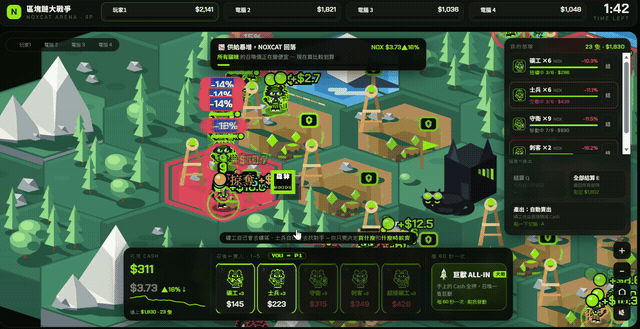
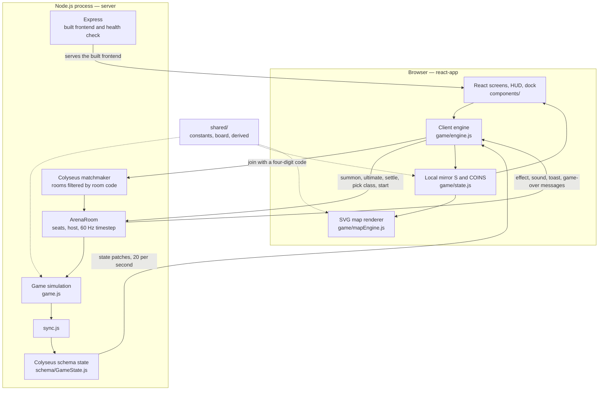

# NOXFLOW



## Problem and Goal

Cryptocurrency can feel inaccessible to newcomers because even basic discussions
assume familiarity with unfamiliar terms, market behavior, and risk. NOXFLOW gives students and first-time learners an approachable entry point where
they can encounter common concepts such as buying, selling, price trends,
volatility, and leverage through play. The goal is not to teach professional
trading, but to build enough foundational understanding and curiosity for
players to continue learning about the field.

We have made NOXFLOW. A resource management autobattler where you fight four other players by watching where the market is moving, placing purchases and liquidating by summoning cute cats into our hand-crafted hexagonal arena. The game is fully online and supports real time multiplayer up to 4 players, each with diverse classes and strategies. NOXFLOW is meant to make investment seem more apporachable and less distant to the general public. After each match, a simple debrief connects the game played with the 

## Core Features

**The game is live.** NOXCAT ARENA is fully deployed at
[noxcat-arena.fly.dev](https://noxcat-arena.fly.dev/) with real-time online
matchmaking. Open the link, press one button, and you are in a match against real
people within seconds. The game supports both mobile and laptop viewports.

- **Real-time multiplayer that is already running:** Hit *quick match* and the
  server drops you into a public room with whoever else is waiting, or draw a
  four-digit room code and hand it to your friends for a private lobby. Every
  match is an authoritative server room, so nobody can bend the market from their
  own browser. Empty seats are filled by AI traders — 巨鯨_0x7f, 散戶聯盟, 做市商
  MM — and if someone's connection drops mid-match, a bot takes the wheel
  instantly while the player gets twenty seconds to fight their way back in.
- **An auto-battler where every unit is an open position:** You never
  micromanage. Summoning a cat *is* buying simulates making transactions in cryptocurreny. The cat carries the quantity it
  bought and the price it paid, walks off to mine or hunt on its own, and loses
  value as it takes damage. Settling it *is* selling at spot. Your portfolio is
  not a menu; it is standing on the battlefield, and you can watch it get shot.
- **A hand-drawn isometric world, not a spreadsheet:** Sixty-one hexes of
  pixel-art terrain — deep pits paying $13/s, quiet little claims paying $6/s, an
  exchange that halves your trading fees, energy peaks that cut your cooldowns,
  forests and dead chains that pay nothing at all. Cats, ore carts, vaults, and
  smoke-puffing houses are all drawn as SVG from shared geometry, so the board is
  crisp at any zoom on desktop or phone.
- **A market that pushes back:** One currency, one chart, one truth for everyone
  at the table. Trends drift, six headline events swing NOX between a 1.85×
  meme-frenzy pump and a 0.55× unlock dump — and your own orders move the price,
  so the whale who all-ins is the whale who slips their own fill.
- **Money is your health bar:** There is no separate HP pool for players. Your
  cash *is* your life. Overtrade, over-leverage, or get raided, and you are
  eliminated. The richest survivor at the three-minute bell wins, unrealized
  positions marked to market.
- **Sixty seconds of peace, then the knives come out:** Combat units stay locked
  for the first minute, so every match opens as a pure economy race and only then
  turns into a fight over other people's mines.
- **Four classes, four real investing lives:** Every class is a different answer
  to "where does your money come from, and how much volatility can you survive?"
  Each has one signature move on a 60-second cooldown — roughly three uses per
  match — and each move is a real strategy, not a fantasy spell.

| Class | Real-world archetype | The hand you are dealt | Signature move |
| --- | --- | --- | --- |
| **小資上班族** · Salaried | Small capital, steady paycheck | $600 to start, 1.5× income, fastest cooldowns | **DCA** — buys a miner every 3 seconds for 24 seconds, completely ignoring the price |
| **定存族** · The Saver | Risk-averse, patient, long-horizon | $1,500 to start, the flattest swings, rewarded for holding | **Staking Lock** — 12 seconds where your cats cannot be hurt and settling is guaranteed not to lose money |
| **梭哈青年** · The Degen | All-or-nothing leverage chaser | $900, cheap units, gains *and* losses doubled | **All-In** — the entire cash balance into a single titan |
| **消息靈通** · The Insider | Trades on information, pays for access | $800, the highest fees on the board, sees news twice as early | **Alpha** — learn the next headline immediately, then hold it back 8 seconds while you position |

- **A post-match debrief that names what you just did:** The result screen ranks
  the table, shows how far you moved from your starting capital, then translates
  your own three minutes into vocabulary — *dollar-cost averaging*, *staking*,
  *position sizing*, *information edge* — using the plays you actually made. That
  is the whole point: the finance lesson arrives *after* the fun, attached to a
  memory of winning or blowing up.

## System Architecture

NOXCAT ARENA is a server-authoritative multiplayer game. One match is one
Colyseus room, and that room owns the only real copy of the simulation. Each
browser is a thin client that mirrors the room state and sends commands. No
decision about money, combat, mining, or prices is ever made on a player's
machine.

The repository is a single npm workspace containing three packages:

```text
noxcat-arena/
├── shared/src/               @noxcat/shared — one copy of the rules, used by both sides
│   ├── constants.js            units, player classes, ultimates, NOX coin factory
│   ├── board.js                the 61-hex board, isometric geometry, SVG tile drawing
│   └── derived.js              balance formulas: fees, mining decay, position value
├── server/src/               @noxcat/server — the authoritative half
│   ├── index.js                HTTP server, Express static files and health check, Colyseus setup
│   ├── rooms/ArenaRoom.js      seats, room code, host, lobby, player messages, 60 Hz loop
│   ├── game.js                 the simulation: units, combat, mining, prices, market events, AI
│   ├── schema/GameState.js     the fields that are actually synchronized to clients
│   └── sync.js                 copies the simulation into schema state once per tick
├── react-app/src/            the browser client
│   ├── game/engine.js          Colyseus connection: mirrors state in, sends commands out
│   ├── game/state.js           the local mirror S, plus the shared formulas bound to it
│   ├── game/mapEngine.js       SVG renderer for the hex map, units, effects, and camera
│   ├── components/             entry, class select, lobby, HUD, map stage, result screens
│   └── hooks/                  useSyncExternalStore bridge from the engine to React
├── Dockerfile                single image holding the server and the built frontend
└── fly.toml                  Fly.io deployment configuration for that image
```



**Joining a match.** Rooms are registered under one room type and filtered by
room code, so a client only ever matches into a room that was created with the
same code. Creating a room draws a random four-digit code and joins or creates,
which means two players who happen to draw the same number share one room
instead of opening two rooms with the same code. Joining by code only joins, so
a wrong code fails instead of silently opening an empty room. Public matchmaking
is the same mechanism with the reserved code `0001`.

**Inside a room.** A room holds exactly four seats. Every seat begins as a
computer-controlled player and is claimed by the next client that joins. The
first client to arrive becomes the host, and host status passes to a remaining
player if the host leaves. The match begins when the host presses start or when
all four seats hold human players, and the room locks at that point. Leaving
during the lobby frees the seat again; leaving during a match returns the seat to
the computer immediately and opens the reconnection window.

**The simulation loop.** Once the match starts, the room runs a fixed 60 Hz
timestep that advances combat, mining, and the countdown. Prices and market
events advance on their own slower cadence, and queued visual and sound effects
are flushed about ten times per second. After every tick, `sync.js` copies the
simulation into the Colyseus schema, which Colyseus broadcasts to clients as
patches twenty times per second. The match ends when the clock runs out or only
one player is left alive, and the room then sends each player a personal summary.

**Two shapes of state on the server.** `game.js` keeps its state as ordinary
JavaScript objects, because the shared balance formulas are written against
ordinary objects and are reused unchanged in the browser. The Colyseus schema in
`schema/GameState.js` is a separate and deliberately smaller structure holding
only what clients actually need. `sync.js` is the one-way bridge between them,
which keeps simulation, synchronization, and networking as three separate
concerns. Anything that is a one-off event rather than a state — hit effects,
sounds, notifications, and the end-of-match report — is sent as a room message
instead of being placed in the schema, and the price history behind the chart is
rebuilt locally by each client rather than resent on every tick.

**The client mirror.** `engine.js` is the only module that knows the game is
networked. It writes incoming schema state into a single local object whose shape
matches the server's, and it turns player input into room messages. Components
read that object and re-render through a `useSyncExternalStore` subscription, so
the interface never needs to know where the data came from. A separate animation
frame loop drives the SVG map, so movement and effects stay smooth between
network patches.

**One copy of the rules.** The `shared` package holds the board layout, the unit
and class tables, and the balance formulas. The server imports it to decide
outcomes and the client imports it to display costs, ranges, and position values,
so the number shown on a card is produced by exactly the same code that the
server will charge the player.

**One origin in production.** The Docker image builds the frontend and ships it
next to the server, and a single Node process serves both the page and the
WebSocket connection on one port. Players therefore need only one URL, and a
secure page upgrades to a secure WebSocket automatically. In development the Vite
dev server and the game server run on separate ports, and the client selects the
correct endpoint for each case.

## Technologies Used

| Category | Technology / Service | Purpose |
| --- | --- | --- |
| Frontend | React 19, Vite, SVG | User interface, development tooling, and battlefield rendering. |
| Backend | Node.js, Colyseus, Express, WebSocket | Multiplayer rooms, matchmaking, synchronization, and authoritative simulation. |
| Shared Logic | npm workspaces, JavaScript modules | Rules and formulas shared by the frontend and backend. |
| Deployment | Docker, Fly.io, GitHub Actions | Single-image build, hosting, and continuous deployment on every push to `main`. |

## Installation and Running

Node.js 22 or newer is required. This repository uses npm workspaces, so run all
installation commands from the repository root.

```bash
# Install frontend, server, and shared-package dependencies.
npm install

# Terminal A: start the Colyseus server on port 2567.
npm run server

# Terminal B: start the frontend development server.
npm run dev
```

Open the local URL printed by Vite. Both commands must remain running while the
game is being played.

To test with phones or other computers on the same local network:

```bash
# Terminal A
npm run server

# Terminal B
npm run dev:lan
```

All devices must use the frontend URL printed by `npm run dev:lan` and must be
connected to the same network. Only the host computer needs to run the project.

To run the production setup locally, where one process serves both the page and
the multiplayer connection:

```bash
npm run preview:prod
```

Additional checks:

```bash
npm run lint
npm run build
```

## Demo

- Live demo URL: [NOXFLOW](https://noxcat-arena.fly.dev/), multiplayer supported.
- Evaluation video: Not available yet.

## Limitations and Future Work

- Match state is held in memory and is not persisted after the server stops, so
  a match interrupted by a restart cannot be resumed.
- A disconnected player has twenty seconds to reconnect. After that, a
  computer-controlled player keeps the seat for the rest of the match.
- All rooms run on a single hosted machine, so total capacity is bound by that
  machine rather than distributed across regions.
- The game still needs broader mobile-device, latency, and balance testing.
- Future work may include persistent player profiles, additional market events,
  improved onboarding, ranked matchmaking, and horizontal scaling.

## Third-Party Services, Data, and Assets

- [React](https://react.dev/) — MIT License.
- [Vite](https://vite.dev/) — MIT License.
- [Colyseus](https://colyseus.io/) — MIT License.
- [Express](https://expressjs.com/) — MIT License.
- [Fly.io](https://fly.io/) — hosting platform for the deployed demo.
- No API keys, tokens, personal information, or external market data are required.
- Any additional visual or audio assets must be documented here before release.

## Team Members

| Name | Responsibility |
| 楊芷翎 | UI, game designer, and prototyping |
| 梁家祥 | System Engineer |
| 葉子倪 | Frontend animation and fullstack engineer |
| 沈采葳 | Frontend design and User experience |
| 陳聖文 | Fullstack engineer, deployment, and CICD |

## License

No project license has been selected yet. Add a `LICENSE` file at the repository
root and replace this section with the chosen license name before distribution.
