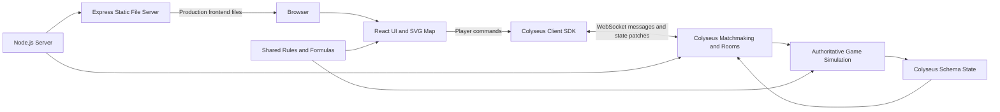

# NOXCAT ARENA

## Problem and Goal

Cryptocurrency can feel inaccessible to newcomers because even basic discussions
assume familiarity with unfamiliar terms, market behavior, and risk. NOXCAT
ARENA gives students and first-time learners an approachable entry point where
they can encounter common concepts such as buying, selling, price trends,
volatility, and leverage through play. The goal is not to teach professional
trading, but to build enough foundational understanding and curiosity for
players to continue learning about the field.

## Core Features

- **Public and private multiplayer:** Players can enter public matchmaking or
  create a private room and invite friends with a four-digit room code. Public
  matchmaking uses the reserved code `0001`: Colyseus joins the player to an
  available public room or creates one when none is available.
- **Three-minute, four-player matches:** A match starts automatically when four
  human players arrive, or the host can start earlier and fill empty seats with
  computer-controlled players.
- **Single-currency market:** Players follow the NOX price chart and market events
  to understand whether the market is rising, falling, or becoming more volatile.
- **Buy and sell through units:** Summoning a cat represents buying NOX. Players
  can later settle one unit, a selected group, or all units to sell their
  positions at the current price.
- **Mining and combat:** Mining units generate value on the hexagonal map, while
  combat units attack opposing positions and protect the player's economy.
- **Risk and survival:** Money also acts as health. Reaching zero eliminates a
  player, while the surviving player with the highest balance at the end wins.
- **Player classes and special actions:** Players choose a class before the match
  and can use abilities such as an all-in action to take greater risks for a
  potentially larger return.

## System Architecture



The frontend uses React for menus and the heads-up display, while an SVG-based
map engine renders the hexagonal battlefield, units, and effects. Player actions
are sent through the Colyseus client SDK over WebSocket.

The Node.js backend uses Colyseus to match players, manage rooms, and receive
commands. Each room owns an authoritative game simulation that calculates unit
behavior, combat, mining, prices, balances, and match results. The simulation is
copied into Colyseus schema state and synchronized back to every connected
client. In production, Express serves the built frontend from the same server,
so the web page and multiplayer connection share one origin.

The `shared` workspace contains rules and formulas used by both the frontend and
backend. This keeps values shown in the interface consistent with calculations
performed by the server.

## Technologies Used

| Category | Technology / Service | Purpose |
| --- | --- | --- |
| Frontend | React 19, Vite, SVG | User interface, development tooling, and battlefield rendering. |
| Backend | Node.js, Colyseus, Express, WebSocket | Multiplayer rooms, matchmaking, synchronization, and authoritative simulation. |
| Shared Logic | npm workspaces, JavaScript modules | Rules and formulas shared by the frontend and backend. |

## Installation and Running

Node.js 20 or newer is required. This repository uses npm workspaces, so run all
installation commands from the repository root.

```bash
# Install frontend, server, and shared-package dependencies.
npm install

# Terminal A: start the Colyseus server on port 2567.
npm run server

# Terminal B: start the frontend development server.
npm run dev
```

Open the local URL printed by Vite. Both commands must remain running while the
game is being played.

To test with phones or other computers on the same local network:

```bash
# Terminal A
npm run server

# Terminal B
npm run dev:lan
```

All devices must use the frontend URL printed by `npm run dev:lan` and must be
connected to the same network. Only the host computer needs to run the project.

Additional checks:

```bash
npm run lint
npm run build
```

## Demo

- Live demo URL: Not available yet.
- Evaluation video: Not available yet.

## Limitations and Future Work

- Development currently assumes that the frontend and Colyseus server are
  reachable on the same host, with the server using port 2567.
- Public production hosting and environment-specific WebSocket configuration
  are not complete.
- Match state is held in memory and is not persisted after the server stops.
- The game still needs broader mobile-device, latency, reconnection, and balance
  testing.
- Future work may include persistent player profiles, additional market events,
  improved onboarding, ranked matchmaking, and production deployment.

## Third-Party Services, Data, and Assets

- [React](https://react.dev/) — MIT License.
- [Vite](https://vite.dev/) — MIT License.
- [Colyseus](https://colyseus.io/) — MIT License.
- [Express](https://expressjs.com/) — MIT License.
- No API keys, tokens, personal information, or external market data are required.
- Any additional visual or audio assets must be documented here before release.

## Team Members

| Name | Responsibility |
| --- | --- |
| To be added | Frontend display and interaction |
| To be added | Player actions and multiplayer flow |
| To be added | Unit behavior and game simulation |

## License

No project license has been selected yet. Add a `LICENSE` file at the repository
root and replace this section with the chosen license name before distribution.
